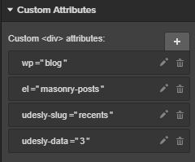

## Masonry Posts

We now added the possibility to view Adapter plugin Contents in a Masonry Fashion. To do this, use these attributes on a div that wraps several Collection Lists:

> wp=blog
>
> el=masonry-posts
>
> udesly-slug={slug-content}
> 
> udesly-data={N. collections}

Example: we want to show recent posts in a Masonry Layout. We have a div that wraps 3 collections. We have set the slug “recents” into the plugin (Contents). What we have to set into the custom attributes field is:

Each Collection List Wrapper contains these attributes:

> udesly-index={sequence number of Collections}
> 
> udesly-data={number of posts in that specific Collection}

**N.B. The number of posts in WordPress must be the same as the sum of all Collection Lists, at the most.**

## Common Links

#### How to add links to the Blog
There are several dynamic links you can usually add to your website:

##### Category Link
This is the link to a specific category archive page. Insert a **Text Link**, **Link Block** or a **Button** and add these attributes:

> wp=blog
>
> el=category-link
>
> udesly-data=your-category-slug

You can find your category slug on WordPress following the path: **Posts->Categories**

##### Tag Link
This is the link to a specific tag archive page. Insert a **Text Link**, **Link Block** or a **Button** and add these attributes:

> wp=blog
>
> el=tag-link
>
> udesly-data=your-tag-slug

You can find your tag slug on WordPress following the path: **Posts->Tags**

##### Blog Link
This is the link to your default Blog Posts Page. Insert a **Text Link**, **Link Block** or a **Button** and add these attributes:

> wp=blog
>
> el=blog-link

## Recent Posts

If you’ve already created a Blog Posts CMS collection in Webflow, skip the following steps.

1) Click on CMS
2) Click on Add New
3) Select Blog Posts collection
4) Customize the collection adding all the WordPress usual fields to have the perfect preview
5) Click on Create
6) Insert some dummy data

Insert a **Collection List** element and connect it to the **Blog Posts** Collection.

Select the Collection List Wrapper in the navigator and insert these attributes for Categories:

> wp=blog
>
> el=recent-posts
>
> udesly-slug=your-collection-slug

**It’s mandatory to insert the udesly-slug attribute with the slug content name you have inserted in the Udesly plugin (in the Contents field that dinamically handles Post Type contents thanks to preset elements).**

Select now the Collection Item from the navigation and customize your posts. You can add all elements or only the one you desire:

##### Title
This will be the title of your blog post. To create it select a **Text Block** and insert the attribute:

> el-child=title

connect it to the field **name** of the CMS

##### Permalink
This is the link to the post. Select a **Link Block**, a **Button** or a **Link Text** element and insert the attribute:

> el-child=permalink

##### Date
This is the publishing date of your post. Select a **Text Block** and insert the attribute:

> el-child=date

Connect it to the field **created on** of the CMS

By default, it gets format from your WordPress settings (You can change it, following the path **Settings -> General -> Date Format**). Otherwise, you can set another format using the attribute

> udesly-data=your format

You find all the available formats [here](https://codex.wordpress.org/Formatting_Date_and_Time)

##### Time
This is the publishing time of your post. Select a **Text Block** and insert the attribute:

> el-child=time

Connect it to the field **created on** of the CMS

By default, it gets format from your WordPress settings (You can change it, following the path **Settings -> General -> Time Format**). Otherwise, you can set another format using the attribute

> udesly-data=your format

You find all the available formats [here](https://codex.wordpress.org/Formatting_Date_and_Time)

##### Featured Image
This is the featured image of your post. You can select a **Div Block** or an **Image** and insert the attribute:

> el-child=featured-image

Connect the image or the background image to the field **full_image** of the CMS

##### Excerpt
This is the excerpt of your post. Select a **Text Block** element and insert the attribute:

> el-child=excerpt

Connect it to the field **excerpt** of the CMS

You can customize the length of the excerpt and the last word from **Udesly Plugin->Settings->Blog**

##### Author
This is the author link of your post. Select a **Text Block** or a **Text Link** element if you want the url linking to blog posts created by that author.
Insert the attribute:

> el-child=author

Connect it to the field **author** of the CMS

##### Avatar
This is the gravatar of the post author. You can select a **Div Block** or a **Image**
Insert the attribute:

> el-child=avatar

Connect the image or the background image to the field **author_image** of the CMS

##### Categories
These are the categories of your post. You can select a **Text Block** and insert the attribute:

> el-child=categories

On default the separator will be “,” . Where there’s a need to change the separator between categories, insert the attribute

> udesly-data=your separator 

**e.g udesly-data=/ will make it shows the “/” between the categories**

##### Tags
These are the tags of your post, you can select a **Text Block**
Insert the attribute:

> el-child=tags

On default the separator will be “,” . Where there’s a need to change the separator between categories, insert the attribute

> udesly-data=your separator 

**e.g udesly-data=/ will make it shows the “/” between the categories**

##### Main Category
This is the main category of the post. Select a **Link Block**, a **Button**, a **Link Text** element or simply a **Text Block** if you don’t need the link.
Insert the attribute:

> el-child=main-category

Don’t forget that you need to set the Main Category for each post if you want to use it.

<iframe width="700" height="419" src="https://www.youtube.com/embed/8_Ih7jcRW4k" frameborder="0" allow="accelerometer; autoplay; encrypted-media; gyroscope; picture-in-picture" allowfullscreen></iframe>

## Posts Slider
Insert a Slider element and assign the attributes:

> wp=blog
>
> el=posts-slider
>
> udesly-slug=the slug of the content

Delete all the slides present in the slider but one. You can add all the elements of Recent Posts in it:

#### Title
This will be the title of your post. To create it select a **Text Block** and insert the attribute:

> el-child=title

connect it to the field **name** of the CMS

#### Permalink
This is the link to the post. Select a **Link Block**, a **Button** or a **Link Text** element and insert the attribute:

> el-child=permalink

#### Date
This is the publishing date of your post. Select a **Text Block** and insert the attribute:

> el-child=date

Connect it to the field **created on** of the CMS
By default, it gets format from your WordPress settings (You can change it, following the path **Settings -> General -> Date Format**). Otherwise, you can set another format using the attribute:

> udesly-data=your format

You find all the available formats [here](https://codex.wordpress.org/Formatting_Date_and_Time)

#### Time
This is the publishing time of your post. Select a **Text Block** and insert the attribute:

> el-child=time

Connect it to the field **created on** of the CMS
By default, it gets format from your WordPress settings (You can change it, following the path Settings -> General -> Time Format). Otherwise, you can set another format using the attribute

> udesly-data=your format

You find all the available formats [here](https://codex.wordpress.org/Formatting_Date_and_Time)

#### Featured Image
This is the featured image of your post. You can select a **Div Block** or an **Image** and insert the attribute:

> el-child=featured-image

Connect the image or the background image to the field **full_image** of the CMS

#### Excerpt
This is the excerpt of your post. Select a **Rich Text** element and insert the attribute:

> el-child=excerpt

Connect it to the field **excerpt** of the CMS
You can customize the length of the excerpt and the last word from **Udesly Plugin->Settings->Blog**

#### Author
This is the author link of your post. Select a **Text Block** or a **Text Link** element if you want the url linking to blog posts created by that author and insert the attribute:

> el-child=author

Connect it to the field **author** of the CMS 

#### Avatar
This is the gravatar of the post author. You can select a **Div Block** or an **Image** and insert the attribute:

> el-child=avatar

Connect the image or the background image to the field **author_image** of the CMS

#### Main Category
This is the main category of the post. Select a **Link Block**, a **Button**, a **Link Text** element or simply a text block if you don’t need the link.
Insert the attribute:

> el-child=main-category

Don’t forget that you need to set the Main Category for each post if you want to use it.
