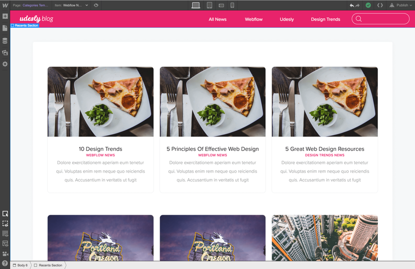
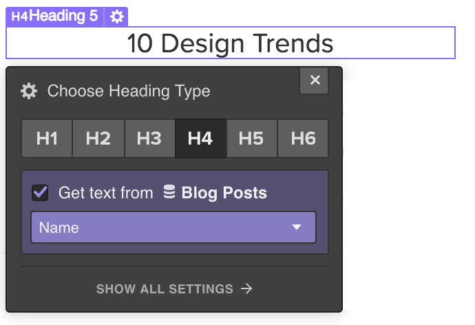
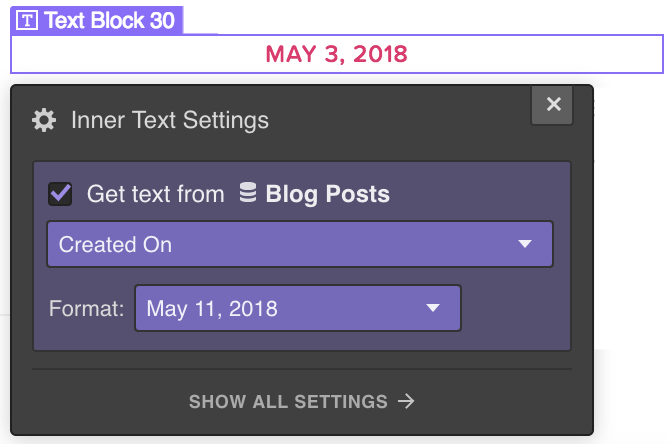
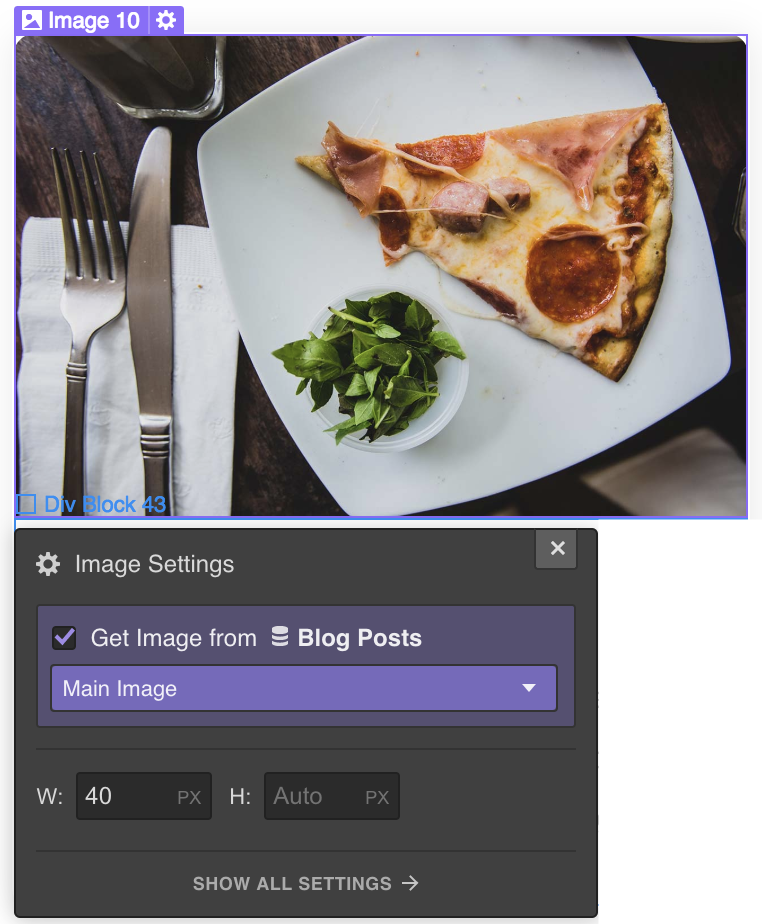
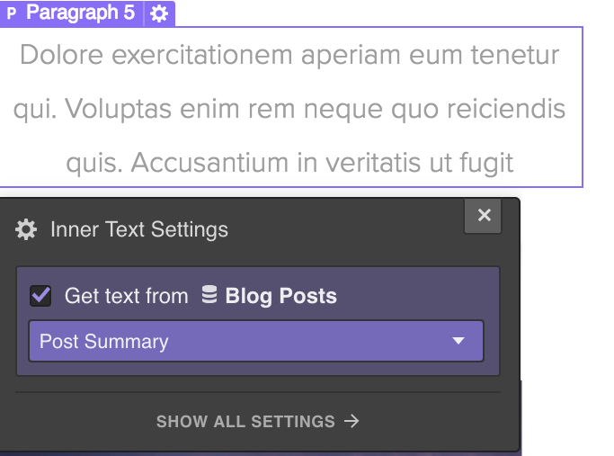
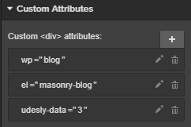

## Blog Posts

#### How to configure Webflow attributes

If you’ve already created a Blog Posts CMS collection in Webflow, skip the following steps.

1) Click on CMS
2) Click on Add New
3) Select Blog Posts collection
4) Customize the collection adding all the WordPress usual fields to have the perfect preview
5) Click on Create
6) Insert some dummy data.

Insert a **Collection List** element and connect it to the **Blog Posts Collection**.
Select **Collection List Wrapper** in the navigator and insert these attributes for Categories

> wp=blog
>
> el=blog-posts

Select now the Collection Item from the navigation and customize your posts. You can add all the elements or only the one you desire:

##### Title
This will be the title of your blog post. To create it select a Text Block
insert the attribute:

> el-child=title

connect it to the field **name** of the CMS

##### Permalink
This is the link to the post. Select a **Link Block**, a **Button** or a **Link Text** element
Insert the attribute:

> el-child=permalink

##### Date
This is the publishing date of your post. Select a **Text Block**
Insert the attribute:

> el-child=date

Connect it to the field **created on** of the CMS

By default, it gets format from your WordPress settings (You can change it, following the path **Settings -> General -> Date Format**). Otherwise, you can set another format using the attribute

> udesly-data=your format

You find all the available formats [here](https://codex.wordpress.org/Formatting_Date_and_Time)

##### Time
This is the publishing time of your post. Select a Text Block
Insert the attribute:

> el-child=time

Connect it to the field **created on** of the CMS

By default, it gets format from your WordPress settings (You can change it, following the path **Settings -> General -> Time Format**). Otherwise, you can set another format using the attribute

> udesly-data=your format

You find all the available formats [here](https://codex.wordpress.org/Formatting_Date_and_Time)

##### Featured Image
This is the featured image of your post. You can select a **Div Block** or an **Image**
Insert the attribute:

> el-child=featured-image

Connect the image or the background image to the field **main image** of the CMS

##### Excerpt
This is the excerpt of your post. Select a **Text Block** element
Insert the attribute:

> el-child=excerpt

Connect it to the field **post summary** of the CMS

You can customize the length of the excerpt and the last word from **Udesly Plugin->Settings->Blog**

##### Author
This is the author link of your post. Select a **Text Block** or a **Text Link** element if you want the url linking to blog posts created by that author
Insert the attribute:

> el-child=author

Connect it to the field **author** of the CMS

##### Avatar
This is the gravatar of the post author. You can select a **Div Block** or an **Image**
Insert the attribute:

> el-child=avatar

Connect the image or the background image to the field **author_image** of the CMS

##### Categories
These are the categories of your post. You can select a **Text Block**
Insert the attribute:

> el-child=categories

On default the separator will be “,” . Where there’s a need to change the separator between categories, insert the attribute

> udesly-data=your separator 
>
> **e.g** udesly-data=/ will make it shows the “/” between the categories

##### Tags
These are the tags of your post, you can select a **Text Block**
Insert the attribute:

> el-child=tags

On default the separator will be “,” . Where there’s a need to change the separator between tags, insert the attribute

> udesly-data=your separator 
>
> **e.g** udesly-data=/ will make it shows the “/” between the tags

##### Main Category
This is the main category of the post. Select a **Link Block**, a **Button**, a **Link Text** element or simply a **Text Block** if you don’t need the link.
Insert the attribute:

> el-child=main-category

Don’t forget that you need to set the Main Category for each post if you want to use it.

<iframe width="700" height="419" src="https://www.youtube.com/embed/AwwxYL38Ghc?list=PLLChkVtVa_ZvN8hkJYizNksV6PiHdkGfj" frameborder="0" allow="accelerometer; autoplay; encrypted-media; gyroscope; picture-in-picture" allowfullscreen></iframe>

## Blog Navigation

To make a functional Blog Navigation you can use several elements like Previous Page, Next Page and Numbers. It’s adviced to use all the elements but you can decide to use only some as well.

> **Previous Page**, **Next Page** and **Numbers** can be used only in the page you set as **Archive Page** in the Udesly Adapter App

#### Previous Page
This is the previous page link. Select a **Link Block**, a **Button**, a **Link Text** element and insert the attributes: 

> wp=blog
>
> el=prev-page

#### Next Page
This is the next page link. Select a **Link Block**, a **Button**, a **Link Text** element and insert the attributes:

> wp=blog
>
> el=next-page

#### Numbers
Insert a **List** element and add the attributes:

> wp=blog
>
> el=numbers

The list MUST have 3 List items.
##### Current
This element gives the current page position. To create it select a **Text Block** and insert it inside the List Item.
Select the List Item from the navigator and insert the attribute:

> el-child=current

##### Number
This element gives the link to a specific page. To create it select a **Button**, **Link Block** or **Text Link** and insert it inside the List Item.
Select the List Item from the navigator and insert the attribute:

> el-child=number

##### Dots
This element is the dots separator that appears when you have a lot of pages. To create it insert an element inside the List Item.
Select the List Item from the navigator and insert the attribute

> el-child=dots

## Archive Categories

#### How to configure Webflow attributes

If you’ve already created a Blog Posts CMS collection in Webflow, skip the following steps.

1) Click on CMS
2) Click on Add New
3) Select Blog Posts collection
4) Customize the collection adding all the WordPress usual fields to have the perfect preview
5) Click on Create
6) Insert some dummy data.

Insert a **Collection List** element and connect it to the **Category Collection**.
Select **Collection List Wrapper** in the navigator and insert these attributes for Categories

> wp=blog
>
> el=archive-categories

Select Collection Item in the navigator and customize your categories/tags. You can insert the following dynamic elements inside the collection item:

##### Name
This is the name of the category/tag. You can insert a **Text Block**, or **Link Block** if you want also the link and insert the attribute:

> el-child=name

and connect it to **category_name** field

##### Permalink
This is the link to the category. Select a **Link Block**, a **Button** element and insert the attribute:

> el-child=permalink

##### Description
This is the category description. You can insert a **Text Block**, a **Header** or a **Paragraph** and insert the attribute:

> el-child=description

and connect it to the **description** field of the CMS

##### Featured Image
This is the featured image of your post. You can select a **Div Block** or an **Image**
Insert the attribute:

> el-child=featured-image

Connect the image or the background image to the field **full_image** of the CMS

<iframe width="700" height="419" src="https://www.youtube.com/embed/Dfi7ZMaehcI?list=PLLChkVtVa_ZvN8hkJYizNksV6PiHdkGfj" frameborder="0" allow="accelerometer; autoplay; encrypted-media; gyroscope; picture-in-picture" allowfullscreen></iframe>

## Archive Title

#### How to configure the Archive Title

> **Archive Title** is an element that can be inserted only in the page you set as **Archive Page** in the Udesly Adapter App.

Select a **Text Block**, a **Header** or a **Paragraph** and insert the attributes:

> wp=blog
>
> el=archive-title

This element displays the archive title based on the queried object. **e.g: Category: Category 1**

It can be customized directly in the Udesly Adapter plugin following the path: **Udesly->Settings->Blog**

<iframe width="700" height="419" src="https://www.youtube.com/embed/97qZ7Y02JnA?list=PLLChkVtVa_ZvN8hkJYizNksV6PiHdkGfj" frameborder="0" allow="accelerometer; autoplay; encrypted-media; gyroscope; picture-in-picture" allowfullscreen></iframe>

## Masonry Blog

#### How to configure Webflow attributes

To view posts in a Blog Page Masonry Fashion, use these attributes on a div that wraps several Collection Lists:

> wp=blog
>
> el=masonry-posts
>
> udesly-data={N. collections}

**Example:** we want to show recent posts in a Masonry Layout. We have a div that wraps 3 collections. What we have to set into the Custom Attributes field is:

Each Collection List Wrapper contains these attributes:

> udesly-index={sequence number of Collections}
>
> udesly-data={number of posts in that specific Collection}

**N.B.** The number of posts in WordPress must be the same as the sum of all Collection Lists, at the most.

#### How to setup pages in the Udesly Adapter

Udesly Adapter should setup the correct pages on its own, automatically. If you need to set them up manually, please consider the following info.

If you’re using the Masonry Blog as main Blog archive of your site, you have to set it as **Archive Page** into the Adapter. Instead, if you are using Custom Post Types (projects, events, etc.), you must set it as **Archive for Custom Post Types**.

#### How to configure the Udesly plugin in the WP admin panel

The main Blog does not require any action on the Udesly plugin.

## Breadcrumbs

#### How to enable breadcrumbs

Breadcrumbs are an easy way to navigate between your posts and categories.

> Breadcrumb is an element that can be inserted only in the page you set as Archive Page or Single Post Page in the Udesly Adapter App.

Insert a **List element** and add the attributes:

> wp=blog
>
> el=breadcrumb

The list MUST have 3 List items:

##### Current
This element gives the current position. To create it select a **Text Block** and insert it inside the List Item.

Select the List Item from the navigator and insert the attribute:

> el-child=current

##### Category
This element gives the previous category link. To create it select a **Button**, **Link Block** or **Text Link** and insert it inside the List Item.

Select the List Item from the navigator and insert the attribute:

> el-child=category

##### Separator
This element is the separator, it will be duplicated between each category. To create it insert an element inside the List Item.

Select the List Item from the navigator and insert the attribute

> el-child=separator

<iframe width="700" height="419" src="https://www.youtube.com/embed/ax2KCbJQzgo?list=PLLChkVtVa_ZvN8hkJYizNksV6PiHdkGfj" frameborder="0" allow="accelerometer; autoplay; encrypted-media; gyroscope; picture-in-picture" allowfullscreen></iframe>
