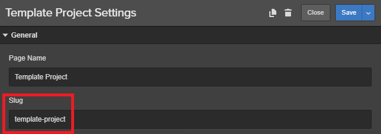

## Single Post Page Elements for Custom Post Types

In the single post page you can insert several elements to customize and have a perfectly functional page. It’s mandatory to label the page **Single Custom Post Type** in the Udesly Adapter App. You can add all or some of the following elements.

If you’ve already created a Blog Posts CMS collection in Webflow, skip the following steps.

1) Click on CMS
2) Click on Add New
3) 3) Create a Custom Post Collection (e.g. “project”)
4) Customize the collection adding all the WordPress usual fields to have the perfect preview
5) Click on Create
6) Insert some dummy data.
After following these steps Webflow usually creates a page labelled **Project Posts Template** (in our example)

Select the **Project Posts Template** page within the CMS Collection pages.
In this page you can have a perfect preview of your Single Post Page if you connect it to the relative CMS Field.

#### Title
This will be the title of your blog post. To create it select a **Text Block** and insert the attribute:

> el-child=title

connect it to the field **name** of the CMS

#### Date
This is the publishing date of your post. Select a **Text Block** and insert the attribute:

> el-child=date

Connect it to the field **created on** of the CMS
By default, it gets format from your WordPress settings (You can change it, following the path **Settings -> General -> Date Format**). Otherwise, you can set another format using the attribute:

> udesly-data=your format

You find all the available formats [here](https://codex.wordpress.org/Formatting_Date_and_Time)

#### Time
This is the publishing time of your post. Select a **Text Block** and insert the attribute:

> el-child=time

Connect it to the field **created on** of the CMS
By default, it gets format from your WordPress settings (You can change it, following the path Settings -> General -> Time Format). Otherwise, you can set another format using the attribute

> udesly-data=your format

You find all the available formats [here](https://codex.wordpress.org/Formatting_Date_and_Time)

#### Featured Image
This is the featured image of your post. You can select a **Div Block** or an **Image** and insert the attribute:

> el-child=featured-image

Connect the image or the background image to the field **full_image** of the CMS

#### Content
This is the content of your post. Select a **Rich Text** element and insert the attribute:

> el-child=content

Connect it to the field **content** of the CMS

#### Excerpt
This is the excerpt of your post. Select a **Text Block** element and insert the attribute:

> el-child=excerpt

Connect it to the field **excerpt** of the CMS

#### Author
This is the author link of your post. Select a **Text Block** or a **Text Link** element if you want the url linking to blog posts created by that author and insert the attribute:

> el-child=author

Connect it to the field **author** of the CMS 

#### Avatar
This is the gravatar of the post author. You can select a **Div Block** or an **Image** and insert the attribute:

> el-child=avatar

Connect the image or the background image to the field **author_image** of the CMS

## Single Post page Templates for Custom Post types

It is mandatory to label this page **template-slug post type** and set the page as **Template for Custom Post Type** in the Udesly Adapter App.

## Taxonomies for Custom Post Types

If you already created a Categories CMS collection in Webflow, skip the following steps.

1) Press on CMS
2) Press on Add New
3) Select a Taxonomy collection (e.g. Categories)
4) Customize the collection adding all WordPress usual fields to have the perfect preview
5) Press on Create
6) Insert some dummy data

**NB: Because Custom Post Types that are automatically generated by the Udesly WP plugin do not provide taxonomies by default, you have to create them by simply filling the field you can find following this path: Udesly–>Custom Types–>your Custom Post Types–>Taxonomies**

Insert a **Collection List** element and connect it to the Category collection.

Select Collection List Wrapper in the navigator and insert these attributes for our Taxonomies

> wp=custom-post-type
>
> el=taxonomies
>
> udesly-data=slug of the taxonomy (e.g. category)

Select Collection Item in the navigator and customize your categories/tags. You can insert the following dynamic elements inside the collection item.

#### Name
this is the name of the category/tag, you can insert a **Text Block**, or **Link Block** if you want also the link.
Insert the attribute:

> el-child=name

and connect it to **category_name** field

#### Permalink
this is the link of the category/tag, you can insert a **Button**, or **Link Block**
Insert the attribute:

> el-child=permalink

#### Description
this is the description of the category/tag, you can insert a **Text Block**, an **Headers** or a **Paragraph**  
Insert the attribute:

> el-child=description

connect it to **description** field of the CMS

#### Featured Image
This is the featured image of your post, you can select a **Div Block** or a **Image**
Insert the attribute:

> el-child=featured-image

Connect the image or the **background image** to the field full_image of the CMS

