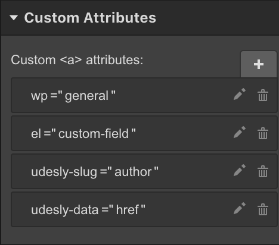
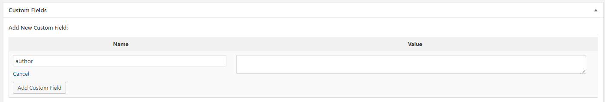

## How to use Custom Fields
If you haven’t already,  enable Custom Fields. Follow these steps:

1. Go to the post or page where you want them to be displayed in the edit post/page screen.
2. Near the top-right corner of the window, click the “Screen Options” button.
3. Check the box that has appeared labeled, “Custom Fields.”
4. Your custom fields should appear at the bottom of the screen, scroll down if you don’t see it.
5. Populate it by assigning a name and a value.
We added the possibility to use Custom Fields with Udesly. Everywhere on your template and every element you’re working with, can be made dynamic.

Use these attributes:

> wp=general
>
> el=custom-field
>
> udesly-slug={custom field slug}
>
>udesly-data={if left blank, the custom field value is injected as element text. If you insert any xHtml attribute, it is automatically injected, instead}

Let’s make an example. In each post of our blog we want to insert an external link to the author page. What we have to do is:

1) Create a button in Webflow with tag and href attribute (that we leave blank).

2) Insert custom attributes, such as:

3) Convert. We populate udesly-slug attribute with “author” because it is the name we are going to assign to our Custom Field.

The Custom Field Value will be populated with the URL of the author website of each single post. It will be dinamically handled.