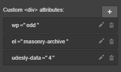

## EDD Downloads

If you’ve already created a Blog Posts CMS collection in Webflow, skip the following steps.

1) Click on CMS
2) Click on Add New
3) Select Blog Posts collection
4) Change the collection’s name to **Downloads**. Customize the collection adding all the WordPress usual fields to have the perfect preview
5) Click on Create
6) Insert some dummy data.

Insert a **Collection List** element and connect it to the **Downloads Collection**.
Select **Collection List Wrapper** in the navigator and insert these attributes for Categories

> wp=edd
>
> el=downloads

Select now the Collection Item from the navigation and customize your products. You can add all the elements or only the one you desire:

#### Title
This will be the title of your product. To create it select a **Text Block**
insert the attribute:

> el-child=title

connect it to the field **name** of the CMS

#### Permalink
This is the link to the product. Select a **Link Block**, a **Button** or a **Link Text** element
Insert the attribute:

> el-child=permalink

#### Date
This is the publishing date of your product. Select a **Text Block**
Insert the attribute:

> el-child=date

Connect it to the field **created on** of the CMS

By default, it gets format from your WordPress settings (You can change it, following the path **Settings -> General -> Date Format**). Otherwise, you can set another format using the attribute

> udesly-data=your format

You find all the available formats [here](https://codex.wordpress.org/Formatting_Date_and_Time)

#### Time
This is the publishing time of your product. Select a **Text Block**
Insert the attribute:

> el-child=time

Connect it to the field **created on** of the CMS

By default, it gets format from your WordPress settings (You can change it, following the path **Settings -> General -> Time Format**). Otherwise, you can set another format using the attribute

> udesly-data=your format

You find all the available formats [here](https://codex.wordpress.org/Formatting_Date_and_Time)

#### Featured Image
This is the featured image of your product. You can select a **Div Block** or an **Image**
Insert the attribute:

> el-child=featured-image

Connect the image or the background image to the field **main image** of the CMS

#### Excerpt
This is the excerpt of your product. Select a **Text Block** element
Insert the attribute:

> el-child=excerpt

Connect it to the field **excerpt** of the CMS

#### Author
This is the author link of your product. Select a **Text Block** or a **Text Link** element if you want the url linking to blog posts created by that author
Insert the attribute:

> el-child=author

Connect it to the field **author** of the CMS

#### Avatar
This is the gravatar of the product author. You can select a **Div Block** or an **Image**
Insert the attribute:

> el-child=avatar

Connect the image or the background image to the field **author_image** of the CMS

#### Main Category
This is the main category of the product. Select a **Link Block**, a **Button**, a **Link Text** element or simply a text block if you don’t need the link.
Insert the attribute:

> el-child=main-category

Don’t forget that you need to set the Main Category for each product if you want to use it.

#### Price
Select a **Text Block** element and insert the attribute:

> el-child=price

#### Purchase Link
Insert a **Link Block** and add the attribute:

> el-child=purchase-link

The Link Block must contain three elements:

> A button containing the attribute: **el-child=add-to-cart**
>
> A div labelled Loader with the attribute: **el-child=loader** (you can use image, gif, svg, etc. )
>
> A checkout button with the attribute: **el-child=checkout**

## EDD Archive Page Elements

The following elements can only be used in the pages you have set as **EDD archive page, EDD Specific Category page, EDD Specific Tag page** in the Udesly Adapter.

#### Archive Title
Select a **Text Block**, a **Header** or a **Paragraph** and insert the attributes:

> wp=edd
>
> el=archive-title

This element displays the archive title based on the queried object. e.g: Category: Category 1
It can be customized directly in the Udesly Adapter plugin following the path: **Udesly->Settings->EDD**

#### Archive Description
Select a **Text Block**, a **Header** or a **Paragraph** and insert the attributes:

> wp=edd
>
> el=archive-description

#### Navigation
To make a functional Shop Navigation you can use several elements like **Previous Page, Next Page and Numbers.** It’s adviced to use all the elements but you can decide to use only some as well.

**Previous Page, Next Page and Numbers can be used only in the page you set as EDD Archive Page in the Udesly Adapter App.**

##### Previous Page
This is the previous page link. Select a **Link Block**, a **Button** or a **Link Text** element and insert the attributes:

> wp=edd
>
> el=prev-page

##### Next Page
This is the next page link. Select a **Link Block**, a **Button**, a **Link Text** element and insert the attributes:

> wp=edd
>
> el=next-page

##### Numbers
Insert a **List** element and add the attributes

> wp=edd
>
> el=numbers

The list must have 3 List items.

- **Current:** This element gives the current page position. To create it select a Text Block and insert it inside the List Item. Select the List Item from the navigator and insert the attribute: **el-child=current**

- **Number:** This element gives the link to a specific page. To create it select a Button, Link Block or Text Linkand insert it inside the List Item. Select the List Item from the navigator and insert the attribute: **el-child=number**

- **Dots:** This element is the dots separator that appears when you have a lot of pages. To create it insert an element inside the List Item. Select the List Item from the navigator and insert the attribute: **el-child=dots**

## Archive Categories

Archive Categories is an element that can be inserted only in the page you set as **EDD Archive Page** in the Udesly Adapter App.

If you’ve already created a Categories CMS collection in Webflow, skip the following steps.

1) Click on CMS
2) Click on Add New
3) Select Categories collection
4) Customize the collection adding all the WordPress usual fields to have the perfect preview
5) Click on Create
6) Insert some dummy data

Insert a **Collection List** element and connect it to the **Category** collection.

Select Collection List Wrapper in the navigator and insert these attributes for Categories:

> wp=edd
>
> el=archive-categories

Select Collection Item in the navigator and customize your categories/tags. You can insert the following dynamic elements inside the collection item.

#### Name
This is the name of the category/tag. You can insert a **Text Block**, or **Link Block** if you want also the link
Insert the attribute:

> el-child=name

and connect it to **category_name** field

#### Permalink
This is the link of the category. You can insert a **Button** or **Link Block** 
Insert the attribute:

> el-child=permalink

#### Description
This is the description of the category. You can insert a **Text Block, a Header or a Paragraph**
Insert the attribute

> el-child=description

connect it to the **description** field of the CMS

#### Featured Image
This is the featured image of the product. You can select a **Div Block** or an **Image**
Insert the attribute:

> el-child=featured-image

Connect the image or the background image to the field **full_image** of the CMS

## Masonry Archive

We now added the possibility to view Adapter plugin Contents in a Masonry Fashion. To do this, use these attributes on a div that wraps several Collection Lists:

> wp=edd
>
> el=masonry-archive
>
> udesly-data={N. collections}

Example: we want to show downloads in a Masonry Layout. We have a div that wraps 4 collections. What we have to set into the Custom Attributes field is:

Each Collection List Wrapper contains these attributes:

> udesly-index={sequence number of Collections}
>
> udesly-data={number of posts in that specific Collection}

**N.B. The number of posts in WordPress must be the same as the sum of all Collection Lists, at the most.**