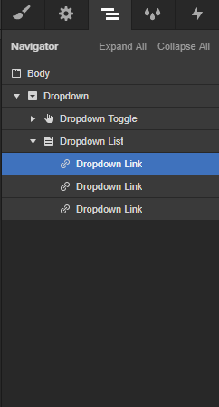

## How to create a Dropdown Menu

Insert the **Dropdown** element. In the Navigator you’ll find several Dropdown Links by default. Select the one you want to make dynamic (the others will remain static and you can delete them, if no needed).

Insert the following attributes to the selected Dropdown Link:

> wp=menu
>
> el=dropdown
>
> udesly-slug=the slug of the WordPress menu
