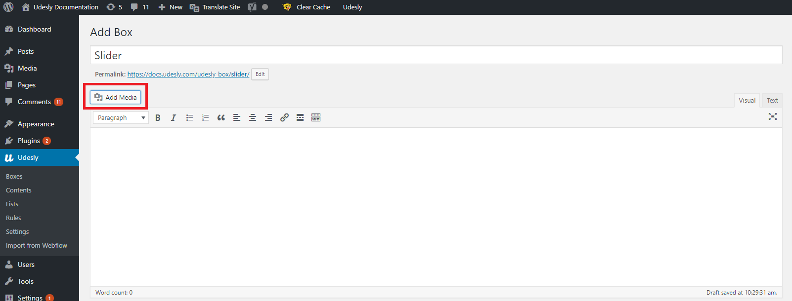
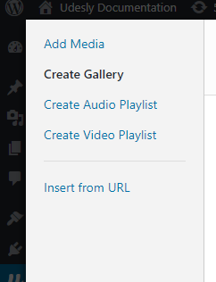
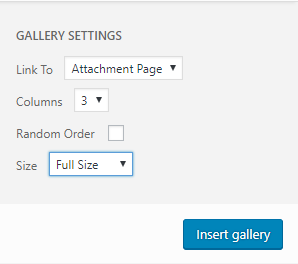

You can now use the Webflow Slider and manage images directly from WordPress, through the Boxes feature.

Insert a **Slider** item into your Webflow project and add these attributes:

> wp=boxes
>
> el=slider
> 
> udesly-slug=slug of your Box

As slug, you can also use the slug labelled dynamic-box (Eg. If you insert the slider in the Single Post Page with this slug, you can have a dynamic slider with different images for each Single Page).

**Don’t forget that the Slider must have ONLY ONE image, that will work just as a placeholder.**

Let see how to manage images on WordPress.

Create a new Box or use an already present Dynamic Box and click on **Add Media** button

Click on **Create Gallery** and select the images you want to add to the gallery.

Finally, click on **Create a new gallery** button on the bottom right corner and set the Size you prefer.

You just have to click on **Insert Gallery** button and that’s done.
