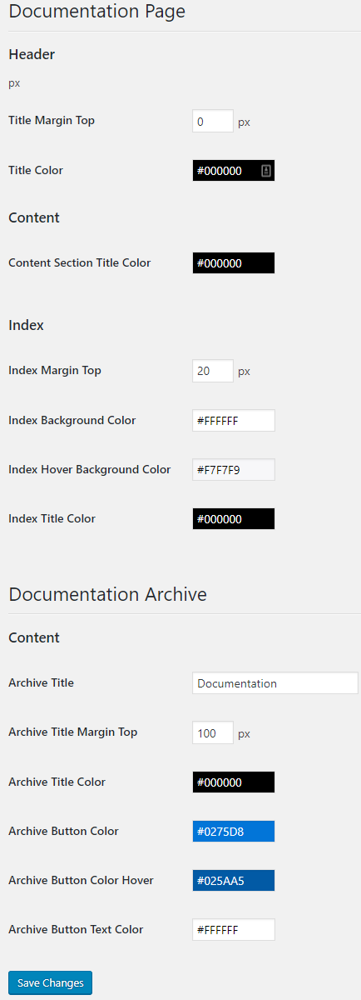

#### Documentation Page
You can find a table that lists all the documentation associated to a specific product. You can click on “Add new” button to add a new doc page with all types of media elements (audio, video, etc).

#### Layout setting page
Here you can manage all aspects of the layout settings for each template part as header, content, index and the documentation archive. Under settings permalinks  you can find the option that allows to manage the url slug for the documentation archive.

#### Template overwrite
You can customize the doc template, simply creating a folder in your active theme directory called cg-edddoc in which you can overwrite the original templates:

**Archive-documentation.php (this page shows the list of docs with the pagination)**

**Single-documentation.php (this page shows the single doc page)**

**Single-documentation-sidebar.php (it contains the index of the single doc page).**

Once you did overwrite these templates, the plugin will show your own templates, instead of the original ones.