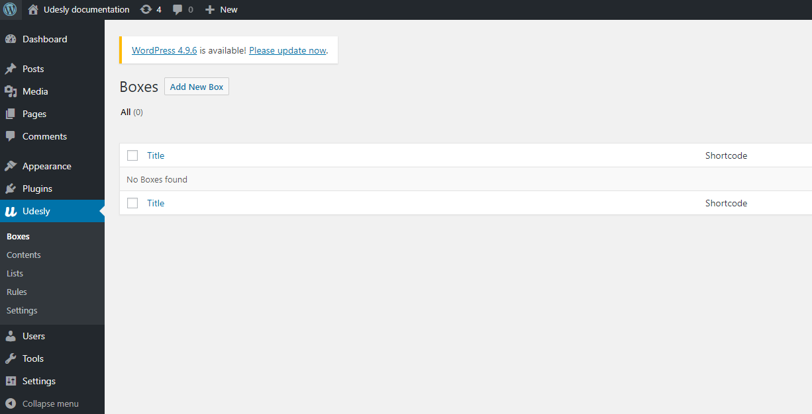
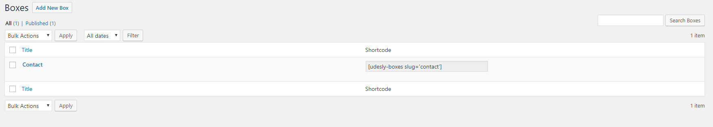

With Boxes you can add dynamic contents into your Webflow project and revise them directly from the WordPress admin panel. You can use Contents for whatever you want: any media,WordPress shortcodes, etc.
You’ll find Boxes extension within the Udesly plugin.

You can add unlimited boxes with any type of content you wish (even some Page builders).
Any time you create a box, you’ll find a correlate shortcode like that:

<iframe width="700" height="419" src="https://www.youtube.com/embed/6L3l82U9fkQ" frameborder="0" allow="accelerometer; autoplay; encrypted-media; gyroscope; picture-in-picture" allowfullscreen></iframe>