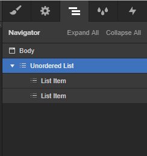

## How to create a List Menu

Insert the **List** element. In the Navigator you’ll find three List items by default. Delete one, because there must be two and only two List items.

Select the List and insert the following attributes to the selected List:

> wp=menu
>
> el=list
>
> udesly-slug=the slug of the WordPress menu

Each List item have to contain a **Button**

In the first List item insert the following attribute:

> el-child=link

It’s a generic link of the Menu.

The second one must contain the attribute:

> el-child=current

It is the element to stylize the current page of your dynamic menu.
