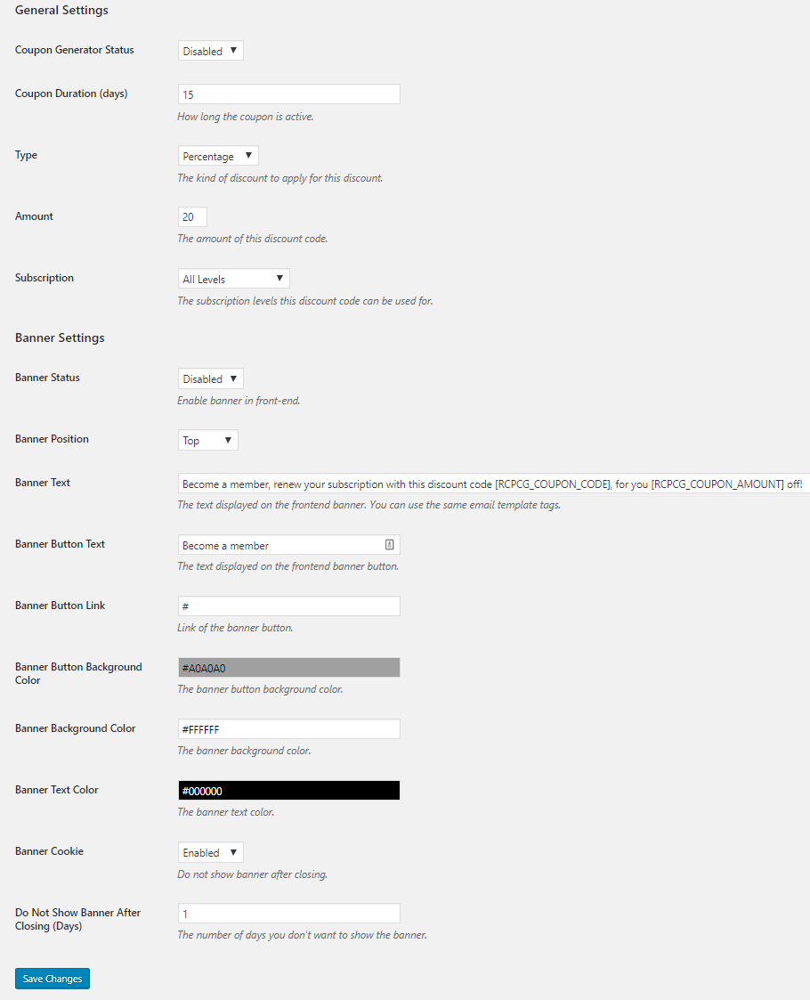
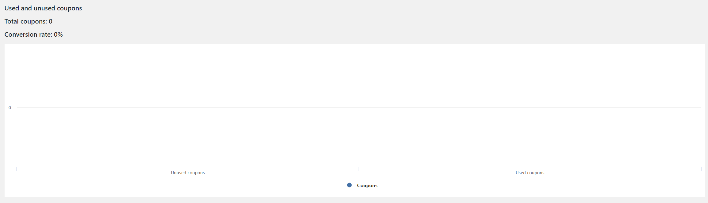
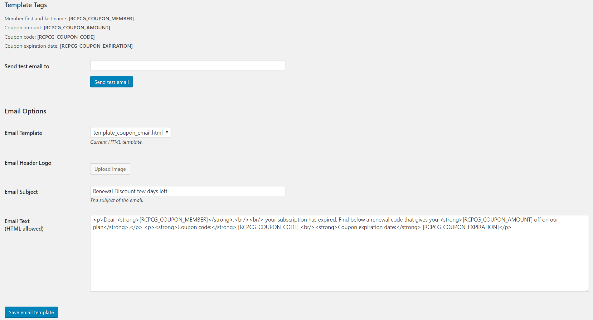

In General settings page you can set up the coupon features ( amount, duration, type, etc.).

In the same page there’s Banner settings options that will appear in the website frontend when an user with an expired subscription is logged in. This banner contains a customizable sentence,  the coupon code and a button that invites the user to renew its subscriptions.

At the bottom of the page there’s a text area in which you can find a log system that allows to track the plugin activities. 

Here you can find a table dispaying all the generated coupons since you enabled the plugin.  You can handle and manage coupons and their content. 

The Report Page shows  all the statistycs that you need to track the convertion rate of the used coupons.

#### Default Template Customization
In the “Email Template” page you will able to customize the template provided by default with the plugin (template_coupon_email.html).

In addition to the possibility to add a logo and customize the email subject, it is possible to personalize the body of the message thanks to template tags.

Template tags are placeholders for dynamic data that changes themselves everytime an email is sent. E.g. template tag [RCPCG_COUPON_CODE] is replaced with coupon code generated for that specific sent email.

The Email body may also contain HTML tags and it is possible to send a test email to check the email layout that users will see.

#### Create a template from scratch
You can add unlimited HTML templates, totally customized. This feature allows to use every framework for the implementation of email templates or create its own template from scratch.

