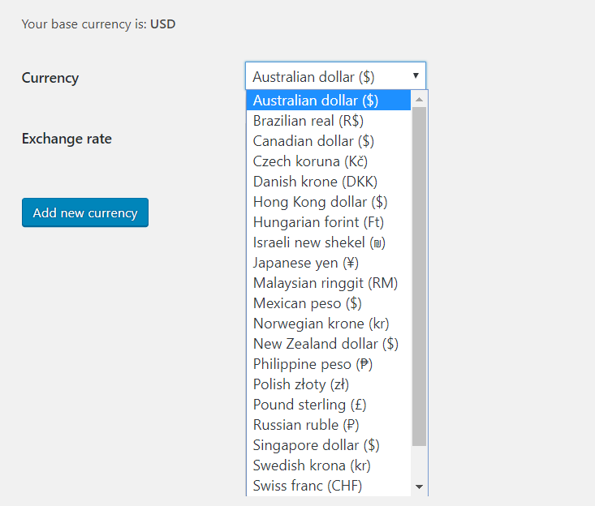

In the RCP Currency page you’ll find a list of currencies that you add, with the option of editing them.

#### Add new currencies
Button “Add Currency” allows to add new currencies with the corresponding exchange rate compared to RCP base currency.

#### Geolocation
This plugin contains a geolocation feature  that automatically identify the user country to calculate the currency correctly.

Furthermore, the plugin gives priority to information that the user had already insert in RCP platform eventually. If they are not present, the plugin uses the geolocation feature in order to apply the correct currency.

