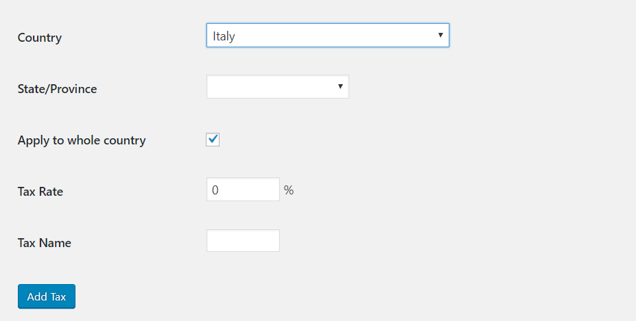
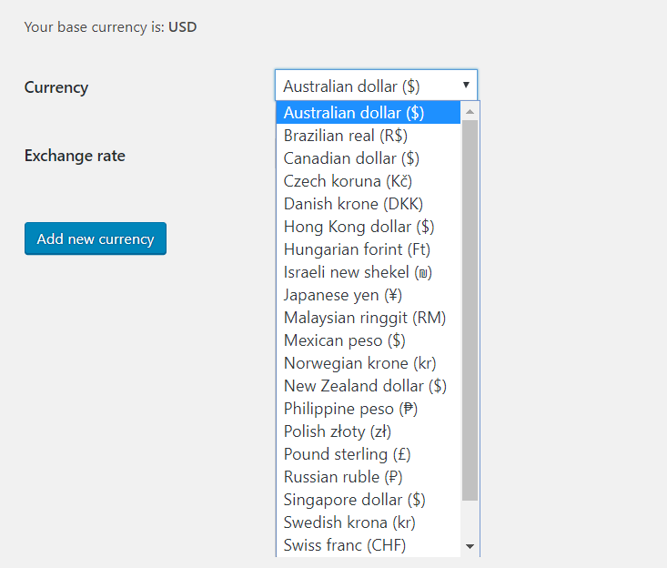

## RCP Taxes

#### How to install RCP Taxes plugin
In the Rcp taxes page you can find a list containing all the taxes that you set up. Cliking on add taxes button, you can add new tax for a specific country and state/province or the whole country.

This plugin contains a geolocation feature  that automatically identify the user country to calculate the tax correctly.

Furthermore, the plugin gives priority to information that the user had already insert in rcp platform eventually. If they are not present, the plugin uses the geolocation feature in order to apply the correct tax.

Another important feature is the possibility to consider the affiliation of a Company to European VIES. A Company registered in it has the possibility to declare it and get a correct invoice for this case. 

## RCP Multicurrency

#### How to install the RCP Multi-currency plugin
In the RCP Currency page you’ll find a list of currencies that you add, with the option of editing them.

**Add new currencies**
Button “Add Currency” allows to add new currencies with the corresponding exchange rate compared to RCP base currency.

**Geolocation**
This plugin contains a geolocation feature  that automatically identify the user country to calculate the currency correctly.

Furthermore, the plugin gives priority to information that the user had already insert in RCP platform eventually. If they are not present, the plugin uses the geolocation feature in order to apply the correct currency.

In the RCP Currency page you’ll find a list of currencies that you add, with the option of editing them.

#### Add new currencies
Button “Add Currency” allows to add new currencies with the corresponding exchange rate compared to RCP base currency.

#### Geolocation
This plugin contains a geolocation feature  that automatically identify the user country to calculate the currency correctly.

Furthermore, the plugin gives priority to information that the user had already insert in RCP platform eventually. If they are not present, the plugin uses the geolocation feature in order to apply the correct currency.

> **RCP Taxes and Multicurrency plugins are supported up to version 2.7 of Restrict Content PRO.**
