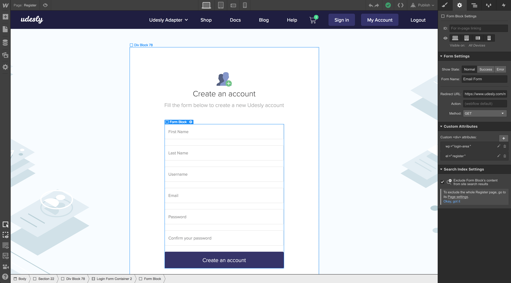
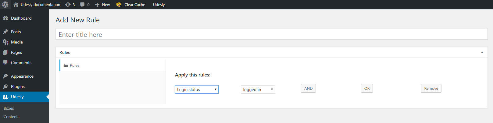
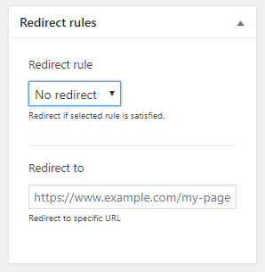

## How to create a Register Form

Insert a **Form** element inside your page and insert the following attributes:

> wp=login-area
>
> el=register

The form must have the following fields:

1) Type = Plain Name = first_name
2) Type = Plain Name = last_name
3) Type = Plain Name = username       Required
4) Type = Email Name = email              Required
5) Type = Password Name = password                 Required
6) Type = Password Name = password_repeat   Required
7) Type = Submit
 

Select the form and change the status to **Error**
Select the error message text block and insert the attribute:

> udesly-data=error-message

In this way the error message text will be replaced with the right message automatically.

<iframe width="700" height="419" src="https://www.youtube.com/embed/b3gg7WPXKYk?list=PLLChkVtVa_ZuGrgLVMEIl0nliPjljc4gm" frameborder="0" allow="accelerometer; autoplay; encrypted-media; gyroscope; picture-in-picture" allowfullscreen></iframe>

#### Best practice

**Logged in** users should not be able to see the page where you insert this form.To this purpose follow these simple steps:

1) Create a **rule** within the Udesly Plugin with the attribute:

> Login Status  = Logged In

2) Select the page where you inserted the register form and set the rule you created before as **Redirect Rule**

3) Optionally you can also insert an url to redirect to. Don’t forget to insert the full path e.g: https://www.udesly.com, or leave it blank to redirect to your **Home Page**

 