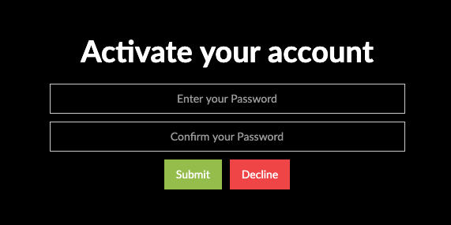

Discover how to configure the "activate account" page in Webflow to get it ready to be converted to Shopify by the Adapter.

As first you need to define the page type adding the custom attribute below to the Body element of the page:

> page=activate

<pre>
<video autoplay muted playsinline="true" loop>
<source src="/assets/page-type.webm">
</video>
</pre>

> **Tips:**
> Take a look at our [elements pack](https://preview.webflow.com/preview/webflow-to-shopify-elements?utm_medium=preview_link&utm_source=designer&utm_content=webflow-to-shopify-elements&preview=71280fc62c37d44b2222bbe7b9a3e953&mode=preview). It’s a set of all the most used elements with the necessary custom attributes already added. You just need to copy and paste the element in your Webflow page and give it your own style. This will help you quicken the workflow. If you have already completed your design and just want to convert the project to Shopify, maybe the quicker way to proceed is to add the custom attributes manually following our guide.
>
> Otherwise, you can start from scratch, following the steps below.

Add a form to this page: select a Form block from the “Add panel” in Webflow *(Add panel > Elements > Forms section)* and add the attribute:

> account=activate

It needs the following input fields:

 **Name**             | **Type** | 
 -------------        | --------------- |
 | password           | password |
 | password_confirmation | password |
 |                        | submit |
 |                         | submit |

 On one of the submit you have to add the attribute 

 > item=decline

---------
> **Take in Mind**
>
> In our documentation you will find custom attributes in 2 formats:
>
> **name=value** or **name={dynamic-value}**
>
>
> **Attribute**             | **Meaning** | 
> -------------             | --------------- |
> | item=title              | *item* is the *Name* and *title* is the *Value* |
> | dimension={dimension}   | *dimension* is the *Name* and instead of {dimension} you have to insert one of the accepted value that you'll find indicated each time. For example dimension can be *master*|