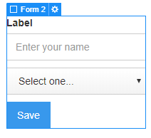

The Addresses page is used is used by visitors to manage their addresses used in the checkout.
It consists in a **Form** to put in a new address and another one to manage the current user’s address.

## New Address Form
Insert a **Form Block** and assign the following attributes:

> shopify=account
>
> el=new-address

The form must have a **Label** field, a **Text input** and a **Select** field that you can customize as you wish.

## User Addresses Form

Insert a **Div Block** and assign the following attributes:

> shopify=account
>
> el=user-addresses

 In this Div Block insert a **Form Block** containing a **Label** field, a **Text input** and a **Select** field that you can customize as you wish.

You can enable pagination among the user addresses adding Previous/Next buttons:

Insert a **Button** mand assign the following attributes to the corresponding element:

> el-child=prev-page
>
> el-child=next-page

Insert another button in order to allow the user to delete its address(es). Assign it the attribute:

> el-child=delete
