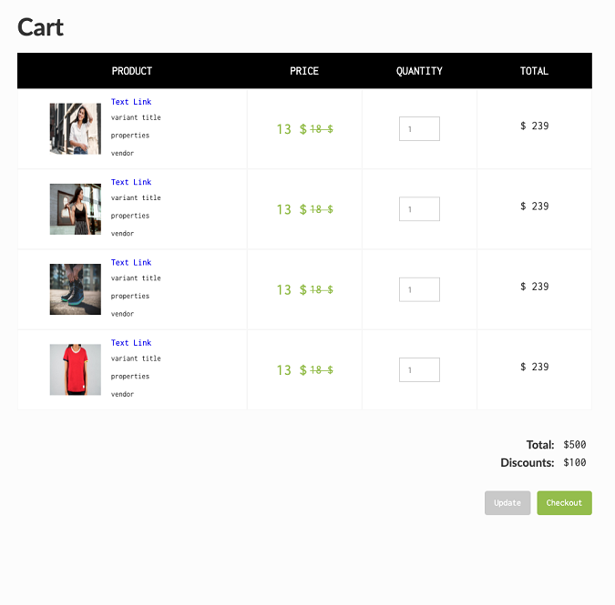

The cart page shows a summary of all of the products that a customer has added to the cart including all the necessary info.

These items can be used only in the page set as **Cart page**.
Cart page must have the following attribute entered on the body:

> page=cart

<pre>
<video autoplay muted playsinline="true" loop>
<source src="/assets/page-type.webm">
</video>
</pre>

> **Tips:**
> Take a look at our [elements pack](https://webflow.com/website/webflow-to-shopify-elements). It’s a set of all the most used elements with the necessary custom attributes already added. You just need to copy and paste the element in your Webflow page and give it your own style. This will help you quicken the workflow. If you have already completed your design and just want to convert the project to Shopify, maybe the quicker way to proceed is to add the custom attributes manually following our guide.
>
> Otherwise, you can start from scratch, following the guide below.

## Cart
Insert a Form block with the following fields:

- 1 submit with the attribute:
  > item=checkout
- 1 submit with the attribute:
  > item=update

The Form block needs 2 Text elements with these attributes, respectively:

> item=cart-total
>
> item=cart-discounts

**It also need a Collection Lists Wrapper inside which you can insert:**

- ### Title

   On Text element:

   > item=title

- ### Vendor

   On Text element:

   > item=vendor

- ### Price

   On Text element:

   > item=price

- ### Total

   On Text element:

   > item=total

- ### Properties

   On Text element:

   > item=properties

- ### Variant

   On Text element:

   > item=variant

- ### Original Price

   On Text element:

   > item=original-price

- ### Quantity

   > item=quantity (it can be entered on a type number input as well)

- ### Link

   On Link element:

   > item=link

- ### Remove

   On Link element:

   > item=remove 

- ### Featured Image

   On img or Div element:

   > item=featured-image

---------
> **Take in Mind**
>
> In our documentation you will find custom attributes in 2 formats:
>
> **name=value** or **name={dynamic-value}**
>
>
> **Attribute**             | **Meaning** | 
> -------------             | --------------- |
> | item=title              | *item* is the *Name* and *title* is the *Value* |
> | dimension={dimension}   | *dimension* is the *Name* and instead of {dimension} you have to insert one of the accepted value that you'll find indicated each time. For example dimension can be *master*|