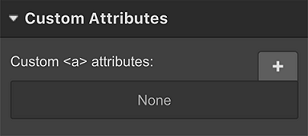
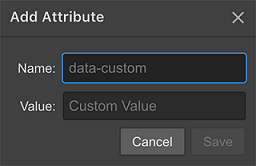

In this section you'll find the most used terms that can help you to better understand Shopify functionalities:

## Handle
Handles are used to identify Shopify objects, such as products, collections, blogs, articles, menus. By default, a handle is the object's title in lowercase with any spaces and special characters replaced by hyphens (-).

For example, a page with the title *"About Us"* can be accessed get the handle *about-us.*

## Template page
If you have a Shopify online store, then you can create webpages in your Shopify admin. Webpages contain information that rarely changes or that customers will reference often, like an *"About Us"* page or a *"Contact Us"* page. For each page you create in Shopify, you can choose the template.

## Default Template page
It's the default template for each page you create in Shopify, if not specified otherwise.

## Collections
You can group your products into collections to make it easier for customers to find them by category.

## Custom Attributes
Custom attributes can be used to append additional information to your elements: they define characteristics of an HTML element.
### Adding custom attributes

- Select the element you want to add the custom attribute to
- Go to the Element settings Panel
- Add [+] a custom attribute

 

- Specify the name and the value
 
 

- Click Save

## Sections
Sections are customizable blocks of content that can be added in Shopify. In each section you can add Options to customize the Section content or style.

## Dynamic Sections
Only in the home page of your Shopify theme, sections may be dinamically manageable: they can be deleted, duplicated, added, arranged. 
To enable this functionality, don't forget that you have to define your section as dynamic.

