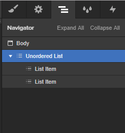

Insert the **List** element.
In the Navigator you’ll find three **List items** by default. Delete one, because there must be two and only two List items.

Select the List and insert the following attributes to the selected List:

> shopify=general
>
> el=menu-list
>
> udesly-slug=the slug of the Shopify menu

Each List item have to contain a **Button**.

In the first List item insert the following attribute:

> el-child=normal

It’s a generic link of the Menu.

The second one must contain the attribute:

> el-child=active

It is the element to stylize the current page of your dynamic menu.
