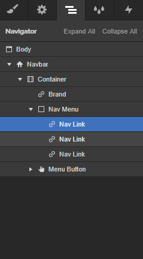

Insert the **Navbar** element.
In the Navigator you’ll find several **Nav Links** by default. Select the one you want to make dynamic (the others will remain static and you can delete them, if no needed).

Insert the following attributes to the selected Nav Link:

> shopify=general
>
> el=nav-menu
>
> udesly-slug=the slug of the Shopify menu
