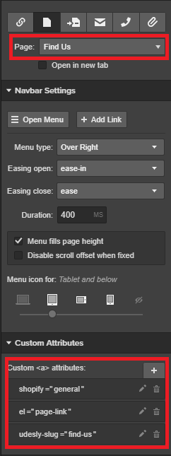

To link the template pages you need to insert these attributes:

> shopify=general
>
> el=page-link
>
> udesly-slug=[slug name in the settings of the page]

Those attributes must be inserted for every link redirecting to a page you set as **Template page** in the Adapter.

**Example:** we have a page labelled "Find us" that we set as Template page into the Adapter. This is how we configure the link:

