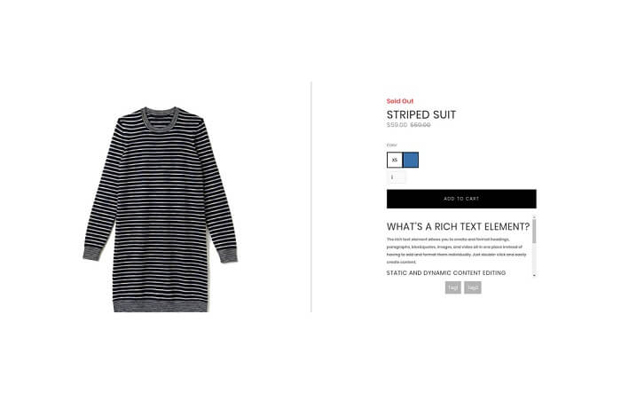

This template renders a detailed page for an individual product. 

These items can be used only in the page set as **Product page**.
Product page must have the following attribute entered on the body:

> page=product

<pre>
<video autoplay muted playsinline="true" loop>
<source src="/assets/page-type.webm">
</video>
</pre>

> **Tips:**
> Take a look at our [elements pack](https://preview.webflow.com/preview/webflow-to-shopify-elements?utm_medium=preview_link&utm_source=designer&utm_content=webflow-to-shopify-elements&preview=71280fc62c37d44b2222bbe7b9a3e953&mode=preview). It’s a set of all the most used elements with the necessary custom attributes already added. You just need to copy and paste the element in your Webflow page and give it your own style. This will help you quicken the workflow. If you have already completed your design and just want to convert the project to Shopify, maybe the quicker way to proceed is to add the custom attributes manually following our guide.
>
> Otherwise, you can start from scratch, following the guide below.

## Title
It's the title of the product and can be added to any text element, will also add the link if set on a link text.
Insert the attribute:

> item=title

## Featured Image
It's the featured image of the product. It can be added to an image or to any other element as background image, will also add the link if set on a link block.
Insert the attribute:

> item=featured-image

To handle featured image settings, there are several optional attributes you can use.

> [dimension={dimension}](shopify-optional-filters#dimension)

> [scale={scale}](shopify-optional-filters#scale)

> [format={format}](shopify-optional-filters#format)

> [crop={crop}](shopify-optional-filters#crop)

*For further info on how to set these optional attributes, please take a look on this [document](shopify-optional-filters)*

## Price
It is the product price. Insert a text element and enter the attribute:

> item=price

## Compare Price
It shows up only if the product is on sale, and is the original price, usually should have line-through. Insert a text item and add the attribute:

> item=compare-price

## Link
It's the link to the product and can be added to any a element. Insert the attribute:

> item=link

## Description
It's the product description and can be added to any text element.
Insert the attribute:

> item=description

## Vendor
If you want to display the vendor's name of that specific product, insert any text element and add the attribute:

> item=vendor

## Type
It's the product type. Insert any text element and add the attribute:

> item=type

## On Sale
Insert the element you wish. It will only appear when a product is on sale (a Div Block with a text, for example). Insert the attribute:

> item=on-sale

## Sold Out
Insert the element you wish. It will only appear when a product is sold-out (a Div Block with a text, for example). Insert the attribute:

> item=sold-out

## Collections
Insert a link element. This one will be repeated and if the link is inside a **List Item**, the whole List Item will be repeated. Insert the attribute:

>item=collections

## Tags
It shows tags of the product and it must be added on a link element. This one will be repeated and if the link is inside a **List Item**, the whole List Item will be repeated.
Insert he attribute:

>item=tags

## Product Images
It can be set on an Image, Div, Slider, Lightbox and on a Lightbox contained in a Collection List item. It will be repeated 1 time for image set (except if you're using a Lightbox not contained in a Collection List item).

> item=product-images

## Add to Cart
Webflow Add to cart gets automatically converted. Use the default Add to cart and enter these elements inside it:

- A Text element with

  > item=option-title

  Option quantity must be enabled, even if hidden by style.

- A Div element with 

  > item=option-wrapper

  and inside it 

   1 label with

   > item=option

   1 label with

   > item=color

You can stylize these label with combo class **"selected"** to define when the variation is selected and with combo class **"soldout"** when the variation is soldout.

### Recommended

Insert a Collection List wrapper with the attribute:

> shop=recommended

Inside the Collection item you can only put limited fields:

- ### Title
   It's the title of the product and can be added to any text element, will also add the link if set on a link text.
   Insert the attribute:

   > item=title

- ### Price
   It is the product price. Insert a text element and enter the attribute:

   > item=price

- ### Link
   It's the link to the product and can be added to any a element. Insert the attribute:

   > item=link

- ### Vendor
   If you want to display the vendor's name of that specific product, insert any text element and add the attribute:

   > item=vendor

- ### Type
   It's the product type. Insert any text element and add the attribute:

   > item=type

- ### Featured Image
   It's the featured image of the product. It can be added to an image or to any other element as background image, will also add the link if set on a link block.
   Insert the attribute:

   > item=featured-image

---------
> **Take in Mind**
>
> In our documentation you will find custom attributes in 2 formats:
>
> **name=value** or **name={dynamic-value}**
>
>
> **Attribute**             | **Meaning** | 
> -------------             | --------------- |
> | item=title              | *item* is the *Name* and *title* is the *Value* |
> | dimension={dimension}   | *dimension* is the *Name* and instead of {dimension} you have to insert one of the accepted value that you'll find indicated each time. For example dimension can be *master*|