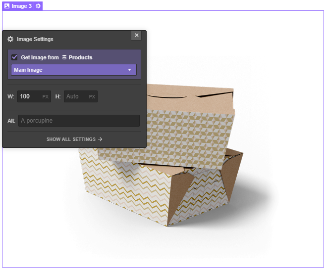
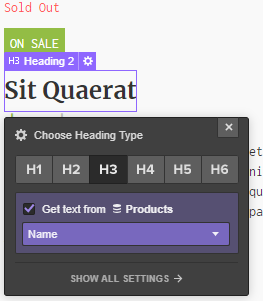
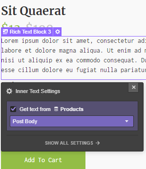

This template renders a detailed page for an individual product. It includes an HTML form that visitors use to select a variant and add it to the cart.

## Featured Image
This is the featured image of the product. You can select a **Div Block** or an **Image**. Insert the attribute:

> el-child=featured-image

Connect the image or the background image to the field **main image** of the CMS

## Title
This will be the title of your product. To create it select a **Text Block** and insert the attribute:

> el-child=title

connect it to the field **name** of the CMS

## Description
This is the description of your product. Select a **Rich Text** item and insert the attribute:

> el-child=description

Connect it to the field **Post Body** of the CMS

## Sold-out
Insert the element you wish. It will only appear when a product is sold-out (a Div Block with a text, for example). Insert the attribute:

> el-child=sold-out

## On Sale
Insert the element you wish. It will only appear when a product is on sale (a Div Block with a text, for example). Insert the attribute:

> el-child=on-sale

## Compare Price
If you have the “On Sale” mode enabled, you can show the discounted price close to the full price. Select a **Text Block** and insert the attribute:

> el-child=compare-price

## Current Price
Select a **Text Block** and insert the attribute:

> el-child=current-price

## Form Block
It’s a form that visitors use to select the quantity of a given product and choose the variations in the case we are faced with a variable product.
Insert a **Form Block** and assign the attribute:

> el-child=add-to-cart

In the Form Block insert a **Text Field** with the attribute:

> el-child= quantity

it will allow to choose the quantity of that given product.

In the same Form Block you can insert a Div Block that will appear dinamically if the product contains some variations that will change the price automatically.

This Div Block must have the following attribute:

> el-child=option-wrapper

## Vendor
If you want to display the entire catalogue of that specific vendor, you have to insert a **Button** with the attribute:

> el-child=vendor

## Tags and Collections
Insert a **List** item and add a link (Tags) within it. The list will have the attribute:

> el-child=tags

A second list will have a second link (Collections). Assign the following attribute to the list:

> el-child=collections

