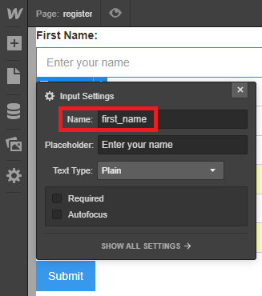
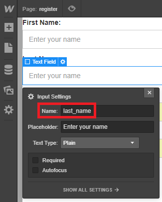
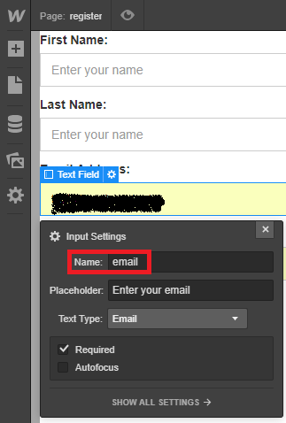
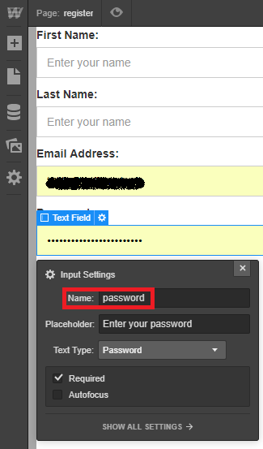

The Register page includes a form for visitors to create a customer account.
Insert a **Form Block** and assign the following attributes:

> shopify=account
>
> el=activate-register

The Form must have these fields with the specific input names indicated in the brackets (MANDATORY):

- First Name (first_name)

- Last Name (last_name)

- Email Address (email)

- Password (password)

