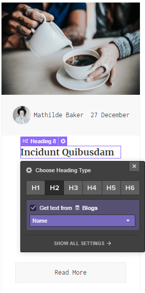
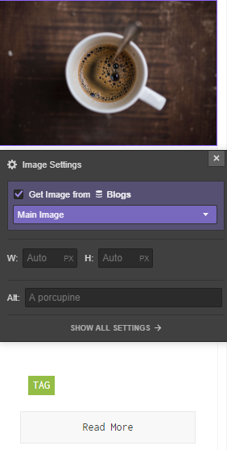
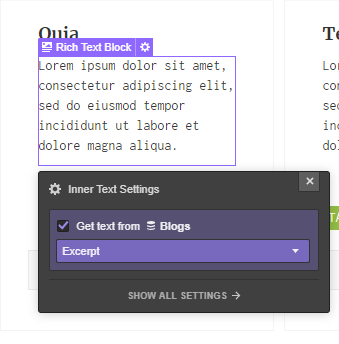
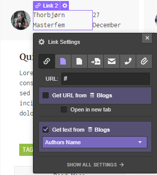
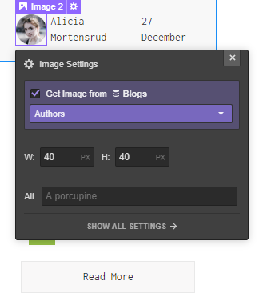

The search template is used to display the results of a storefront search.
If you’ve already created a Products CMS collection in Webflow, skip the following steps.

1) Click on CMS
2) Click on Add New
3) Select Blog Posts collection (give it the name you prefer)
4) Customize the collection to have the perfect preview
5) Click on Create
6) Insert some dummy data.

Insert a **Div Block** and insert these attributes:

> shopify=search
>
> el=search-container

Within it insert a **Collection List** element and connect it to your Collection.
Select Collection List Wrapper in the navigator and insert these attributes:

> shopify=search
>
> el=search-results

Select now the Collection Item from the navigation and customize your posts/products. You can add all elements or only the one you desire:

#### Title
This will be the title of your search result. To create it select a **Text Block** and insert the attribute:

> el-child=title

connect it to the field **name** of the CMS

#### Link
This is the link to the search result, select a **Link Block**, a **Button** or a **Link Text** element and insert the attribute:

> el-child=permalink

#### Date
This is the publishing date of your search result. Select a **Text Block** and insert the attribute:

> el-child=date

#### Featured Image
This is the featured image of your search result. You can select a **Div Block** or an **Image** and insert the attribute:

> el-child=featured-image

Connect the image or the background image to the field **full_image** of the CMS

#### Excerpt
This is the excerpt of your search result. Select a **Text Block** element and insert the attribute:

> el-child=excerpt

Connect it to the field **excerpt** of the CMS.

#### Author
This is the author link of your search result. Select a **Text Block** or a **Text Link** element if you want the url linking to blog posts created by that author and insert the attribute:

> el-child=author

Connect it to the field **authors_name** of the CMS 

#### Avatar
This is the gravatar of the search result. You can select a **Div Block** or an **Image** and insert the attribute:

> el-child=avatar

Connect the image or the background image to the field **authors** of the CMS

#### Tags
Insert a **List** element and add a link (Tags) within it. The list will have the attribute:

> el-child=tags

#### Pagination
The Pagination buttons must be contained in the parent **Search Container** necessarily, otherwise the pagination does not work.
Assign the appropriate attributes to the corresponding button. They are:

> shopify=search
>
> el=prev-page

and

> shopify=search
>
> el=next-page

#### Search Count
To enable the Search Count feature, insert a **Text Block** and assign the attributes:

> shopify=search
>
> el=search-results-count

#### Search Terms
To enable the Search Terms feature, insert a **Text Block** and assign the attributes:

> shopify=search
>
> el=search-terms
