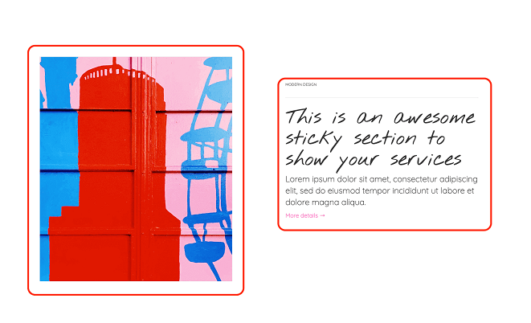

Sections are customizable blocks of content that can be added in Shopify. In each section you can add Options to customize the Section content or style.

> **Tips:**
> Take a look at our [elements pack](https://preview.webflow.com/preview/webflow-to-shopify-elements?utm_medium=preview_link&utm_source=designer&utm_content=webflow-to-shopify-elements&preview=71280fc62c37d44b2222bbe7b9a3e953&mode=preview). It’s a set of all the most used elements with the necessary custom attributes already added. You just need to copy and paste the element in your Webflow page and give it your own style. This will help you quicken the workflow. If you have already completed your design and just want to convert the project to Shopify, maybe the quicker way to proceed is to add the custom attributes manually following our guide.
>
> Otherwise, if you want to start from scratch, follow the guide below.

Take a DIV BLOCK item and add attribute:

> section={unique section name}

Only on the home page you can add the attribute: 

> dynamic=true 

This allow the user to add or remove a section on the front page.

N.B: Remember that if you create a dynamic section you MUST set in the home page a div container with attribute 

> item=content-for-index

this is the place where all the sections added to the page will be shown.

## Sections Options

To make elements customizable from the admin panel you have to add the following options elements into the div block above. 

#### Option Text
It creates an option to modify the text of the section. Insert a Text item and add the attribute:

> option:text={Option Name}

#### Option Textarea
It creates an option to modify the text of the section. Insert a Text item and add the attribute:

> option:textarea={Option Name}

#### Option Richtext
It creates an option to modify the text of the section. Insert a RichText item and add the attribute:

> option:richtext={Option Name}

#### Option HTML
It creates an option to modify the text of the section. Insert a Text item and add the attribute:

> option:html={Option Name}

#### Option Image
It creates an option to modify the image of the section. Insert a Div or Image item and add the attribute:

> option:image={Option Name}

#### Option URL
It creates an option to modify the href of the section. Insert a Link item and add the attribute:

> option:url={Option Name}

#### Option Page
It creates an option to modify the href of the section. Insert a Link item and add the attribute:

> option:page={Option Name}

#### Option checkbox
It creates an option to show or hide an element of the section. Insert any item and add the attribute:

> option:checkbox={Option Name}

---------
> **Take in Mind**
>
> In our documentation you will find custom attributes in 2 formats:
>
> **name=value** or **name={dynamic-value}**
>
>
> **Attribute**             | **Meaning** | 
> -------------             | --------------- |
> | item=title              | *item* is the *Name* and *title* is the *Value* |
> | dimension={dimension}   | *dimension* is the *Name* and instead of {dimension} you have to insert one of the accepted value that you'll find indicated each time. For example dimension can be *master*|