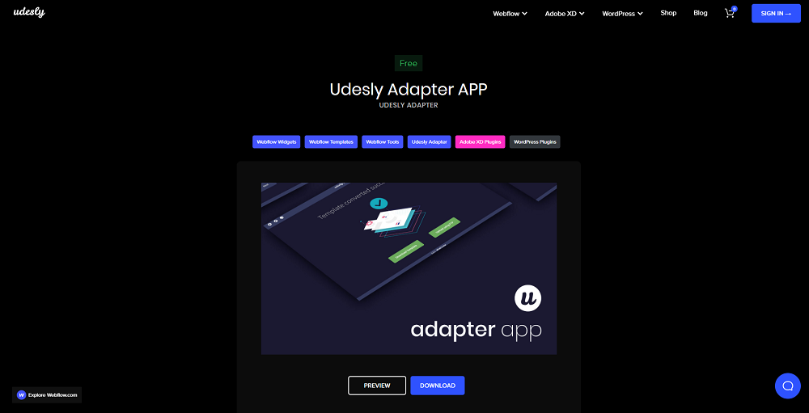
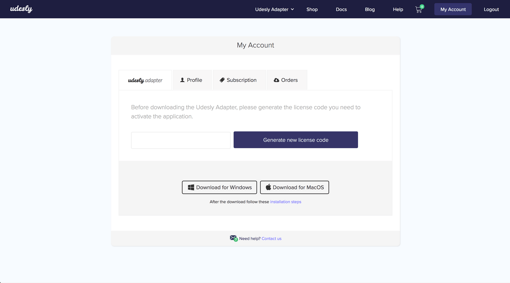
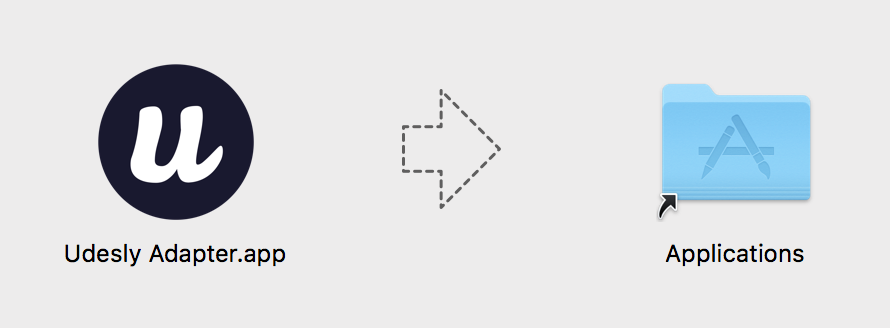
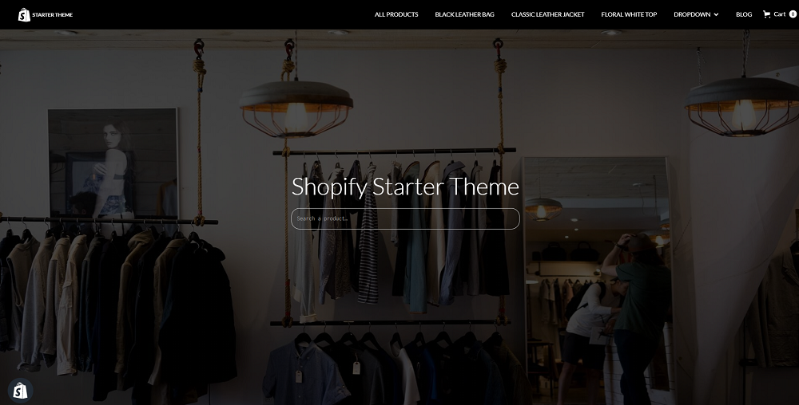
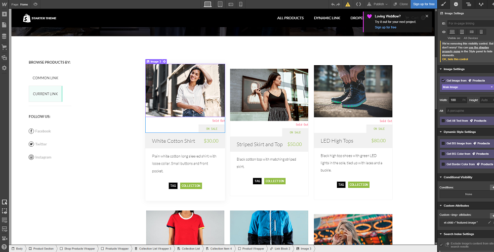
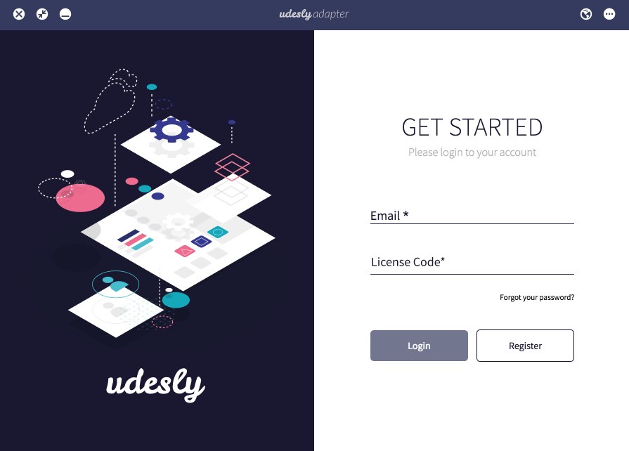
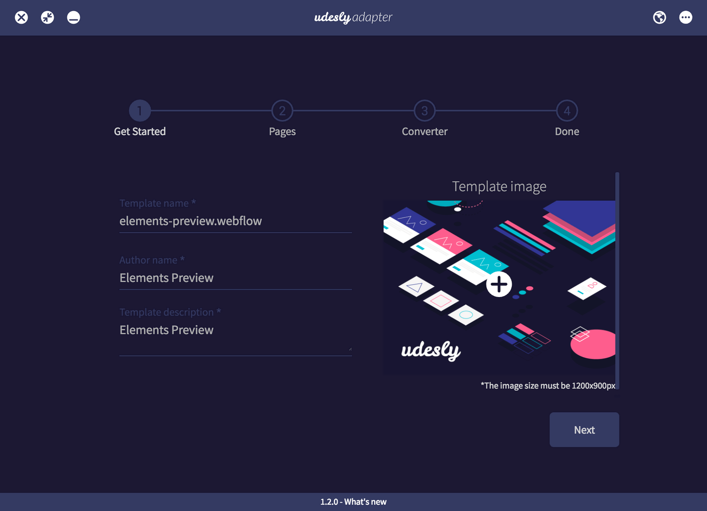
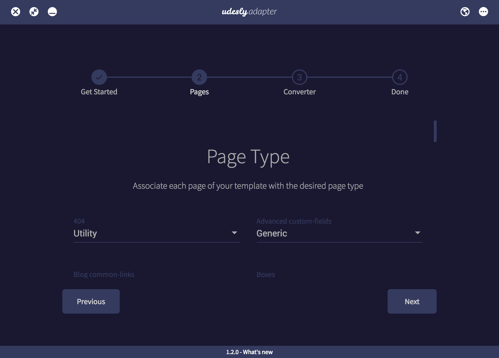

## Create a Shopify account
Create a Shopify account form [here](https://it.shopify.com/)

## Download the APP
Download the Udesly App from [this page](https://www.udesly.com/shop/udesly-app/).

## Generate the License Code
Go to your account page to generate the license code you need to activate the application.

## Install on MAC OS/Windows
 **MAC OS** 
After you double click on the .dmg file you need to drag&drop the Udesly App in your Application folder

 **Install on Windows** 
Double click on the .exe file to launch the App.

## Clone the Starter Theme in Webflow
Clone the Shopify Starter Theme in your Webflow account from this page.

## Customize the template
The Shopify Starter theme is the correct way to start your project. You can customize each single part of your theme add your own content, but you can’t delete the pre-styled content of the theme.

## Export the template
Once your design is finished, you can export your template.

## Activate the APP
Insert your email and the license code you’ve generated from your account page.

## Choose Shopify
Choose the Shopify section to upload your template.

## Upload the template
Upload the exported Webflow template.

## Insert your template data
Insert your template name, the author name and a template description.

## Select pages of your template
This is the most important step. Here you need to set up all the pages of your Webflow template to make them ready to use in Shopify.

Here is the list of the page types you can assign to each page of your Webflow project:
You will find a default page setting. If you don’t need to add other pages from the Webflow project, everything is already configured and ready to work with Shopify. Please note that the following pages are mandatory pages to create a complete and well working Shopify Theme.
‍
- Product page: It’s page for an individual product. It includes content that visitors use to select a variant and add it to the cart.
‍
- Search Results: The search results page is used to display the search results of a store.

- Collections list: The collections list page is used to render a page where all of the collections in the shop are listed. This page can be accessed by going to /collections of the shop.

- Blog:‍ The blog page is used to render the blog page. The primary purpose of this page is to list the articles within a blog.

- Login: The login page is used by visitors to log in to their customer account page.

- Cart: The cart page provides an overview of the items in the visitor’s cart. The overview is typically shown in an HTML table, with each line item displayed in a row.

- Article: Is a page for an individual blog article. It contains the full contents of an article as well an optional comments section for visitors.

- Account: The account page is used to display a summary of the visitor’s customer account.

- Index: The index page is the home page of the store. The template is loaded when you go to the root (“/”) of the store.
‍
- Customer activate account: The customers/activate account page is used to display the form for activating a customer account.

- Order: The order page displays the details of a visitor’s past order.

- Default Page: The default page template is used to render your shop’s pages.

- Register: The customers/register page includes a form for visitors to make a Customer account.

- Addresses: The addresses page is used by visitors to manage their addresses used in the checkout.

- Collection: The collection page is used to render the collection page. The primary purpose of this page is to list the products within a collection, often presented as a grid of images with product titles and prices.

- 404: The 404 template renders a page where visitors are taken to if they enter an invalid URL for the shop.

- Reset Password: The reset password page includes a form for visitors to enter a new password for their customer account.

- Password Page: The password page is used to render your online store’s password page. This page appears only when you add password protection to your online store. To see what this looks like, you can visit our password-protected demo store.

- Gift Card: This page renders the gift card issued to a customer upon purchase. The URL to the gift card page is found in email notifications sent to the customer when a gift card is purchased. Within the gift card page, you can use the gift card object’s attributes to display a gift card’s details. A default gift card page is created automatically when the Gift Card feature is activated in a store.

## Optional Settings
In this step you can choose if you want to manage your website SEO from Webflow or from the Shopify admin panel directly. We suggest not to check the “Remove Webflow jQuery” to make it work correctly.

## Start the conversion
You’re finally ready to convert your template. Just click on the “convert” button and the conversion will start.

## Download the template
Once the conversion is ended you can download the converted template (zip file) on your pc.

## Upload the template to Shopify
Now you can upload the converted theme (.zip file) from your Shopify admin panel. Go to Online store -> Themes and then click on the “Upload Theme” button.

## Set the Shopify store
Follow this [full doc](https://help.shopify.com/en/manual/using-themes/change-the-layout/documentation) to learn everything about a Shopify store (products, collection, payments, shipping and other settings).

<iframe width="700" height="419" src="https://www.youtube.com/embed/0xiscAUFoAo" frameborder="0" allow="accelerometer; autoplay; encrypted-media; gyroscope; picture-in-picture" allowfullscreen></iframe>