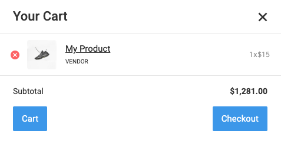
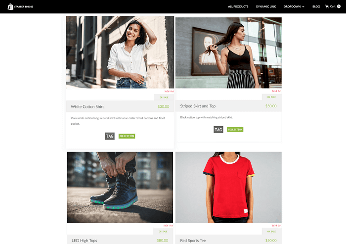
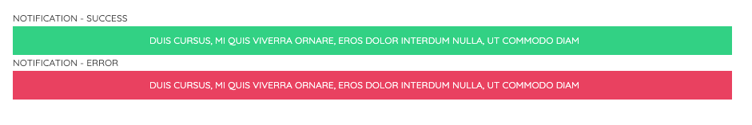

These elements can be added on all pages of your Website.

> **Tips:**
> Take a look at our [elements pack](https://preview.webflow.com/preview/webflow-to-shopify-elements?utm_medium=preview_link&utm_source=designer&utm_content=webflow-to-shopify-elements&preview=71280fc62c37d44b2222bbe7b9a3e953&mode=preview). It’s a set of all the most used elements with the necessary custom attributes already added. You just need to copy and paste the element in your Webflow page and give it your own style. This will help you quicken the workflow. If you have already completed your design and just want to convert the project to Shopify, maybe the quicker way to proceed is to add the custom attributes manually following our guide.
>
> Otherwise, you can start from scratch, following the guide below.

## Checkout Link

On links and button you can use the following attribute to link to the checkout:

> shop=checkout-link

## Cart Link

On links and button you can use the following attribute to link to the cart:

> shop=cart-link

## Collection Link

On links and button you can use the following attribute to link to a collection of your shop:

> collection-link={collection handle}

e.g: collection-link=shoes will link to a collection with handle shoes

## Product Link

On links and button you can use the following attribute to link to a product of your shop:

> product-link={product handle}

e.g: product-link=blue-shoes will link to a Product with handle blue-shoes

## Cart Count

The number of items in the Cart

> shop=carts-count

## Mini Cart

Use Webflow native mini cart needs this attribute:

> shop=mini-cart

Hide the native Collection List inside it (it's not exported as HTML) and replace it with a simple List with the attribute:

> item=products-list

Inside the List Item you can insert the following elements: 

- ### Title

    On text elements you can add the following attribute to get the Product Title:

    > item=title

- ### Vendor

    On text elements you can add the following attribute to get the Product Vendor:

    > item=vendor

- ### Price

    On text elements you can add the following attribute to get the Product Price:

    > item=price

- ### Total

   On text elements you can add the following attribute to get the Product Total Price:

    > item=total

- ### Quantity

    On text elements you can add the following attribute to get the Product quantity:

    > item=quantity

- ### Link

    On link elements you can add the following attribute to get the Product Link:

    > item=link

- ### Remove

    On link elements you can add the following attribute to add the functionality of removing the Product from the cart:

    > item=remove

- ### Featured Image

    On image or div elements you can add the following attribute to get the Product Featured Image:

    > item=featured-image

## Products List

It can be used everywhere. The attribute must be set on a Collection lists wrapper, no pagination.

> shop:products={your shop setting name}

This element will create a Collection picker setting where your customer will be able to choose a Collection and how many products to show.

Inside Collection item you can use the following attributes:

- ### Title
   It's the title of the product and can be added to any text element, will also add the link if set on a link text.
   Insert the attribute:

   > item=title

- ### Featured Image
   It's the featured image of the product. It can be added to an image or to any other element as background image, will also add the link if set on a link block.
   Insert the attribute:

   > item=featured-image

   To handle featured image settings, there are several optional attributes you can use.

   > [dimension={dimension}](shopify-optional-filters#dimension)

   > [scale={scale}](shopify-optional-filters#scale)

   > [format={format}](shopify-optional-filters#format)

   > [crop={crop}](shopify-optional-filters#crop)

   *For further info on how to set these optional attributes, please take a look on this [document](shopify-optional-filters)*

- ### Price
   It is the product price. Insert a text element and enter the attribute:

   > item=price

- ### Compare Price
   It shows up only if the product is on sale, and is the original price, usually should have line-through. Insert a text item and add the attribute:

   > item=compare-price

- ### Link
   It's the link to the product and can be added to any a element. Insert the attribute:

   > item=link

- ### Description
   It's the product description and can be added to any text element.
   Insert the attribute:

   > item=description

- ### Vendor
   If you want to display the vendor's name of that specific product, insert any text element and add the attribute, you can also add it on link elements:

   > item=vendor

- ### Type
   It's the product type. Insert any text element and add the attribute:

   > item=type

- ### On Sale
   Insert the element you wish. It will only appear when a product is on sale (a Div Block with a text, for example). Insert the attribute:

   > item=on-sale

- ### Sold-out
   Insert the element you wish. It will only appear when a product is sold-out (a Div Block with a text, for example). Insert the attribute:

   > item=sold-out

- ### Collections
   Insert a link element. This one will be repeated and if the link is inside a **List Item**, the whole List Item will be repeated. Insert the attribute:

   >item=collections

- ### Tags
   It shows tags of the product and it must be added on a link element. This one will be repeated and if the link is inside a **List Item**, the whole List Item will be repeated.
   Insert he attribute:

   >item=tags

- ### Add to Cart
   No need for attributes, use the Add to Cart of Webflow

## Shop Notifications

It can be entered only once in the project, if not set it will fallback to unstyled notifications.

There can be two notification types: 

- ### Notification Success

    On a Div add the attribute:

    > shop=notification-success

    The Div must contain a Text element with:

    > item=message

- ### Notification Error

  On a Div add the attribute:

    > shop=notification-error

    The Div must contain a Text element with:

    > item=message

its adviced to set transition for opacity on the div for animation and set it as **Position fixed**

---------
> **Take in Mind**
>
> In our documentation you will find custom attributes in 2 formats:
>
> **name=value** or **name={dynamic-value}**
>
>
> **Attribute**             | **Meaning** | 
> -------------             | --------------- |
> | item=title              | *item* is the *Name* and *title* is the *Value* |
> | dimension={dimension}   | *dimension* is the *Name* and instead of {dimension} you have to insert one of the accepted value that you'll find indicated each time. For example dimension can be *master*|