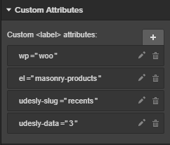

## Recent Products

If you’ve already created a Blog Posts CMS collection in Webflow, skip the following steps.

1) Click on CMS
2) Click on Add New
3) Select Blog Posts collection
4) Change the collection’s name to “Products”. Customize the collection adding all the WordPress usual fields to have the perfect preview
5) Click on Create
6) Insert some dummy data

Insert a **Collection List** element and connect it to the **Products** Collection.

Select the Collection List Wrapper in the navigator and insert these attributes for Categories:

> wp=woo
>
> el=recent-products
>
> udesly-slug=your-collection-slug

**It’s mandatory to insert the udesly-slug attribute with the slug content name you have inserted in the Udesly plugin (in the Contents field that dinamically handles Post Type contents thanks to preset elements).**

Select now the Collection Item from the navigation and customize your products. You can add all elements or only the one you desire:

#### Title
This will be the title of your product. To create it select a **Text Block** and insert the attribute:

> el-child=title

connect it to the field **name** of the CMS

#### Permalink
This is the link to the product. Select a **Link Block**, a **Button** or a **Link Text** element and insert the attribute:

> el-child=permalink

#### Date
This is the publishing date of your product. Select a **Text Block** and insert the attribute:

> el-child=date

Connect it to the field **created on** of the CMS
By default, it gets format from your WordPress settings (You can change it, following the path **Settings -> General -> Date Format**). Otherwise, you can set another format using the attribute:

> udesly-data=your format

You find all the available formats [here](https://codex.wordpress.org/Formatting_Date_and_Time)

#### Time
This is the publishing time of your product. Select a **Text Block** and insert the attribute:

> el-child=time

Connect it to the field **created on** of the CMS
By default, it gets format from your WordPress settings (You can change it, following the path Settings -> General -> Time Format). Otherwise, you can set another format using the attribute

> udesly-data=your format

You find all the available formats [here](https://codex.wordpress.org/Formatting_Date_and_Time)

#### Featured Image
This is the featured image of your product. You can select a **Div Block** or an **Image** and insert the attribute:

> el-child=featured-image

Connect the image or the background image to the field **full_image** of the CMS

#### Excerpt
This is the excerpt of your product. Select a **Rich Text** element and insert the attribute:

> el-child=excerpt

Connect it to the field **excerpt** of the CMS
You can customize the length of the excerpt and the last word from **Udesly Plugin->Settings->Woocommerce**

#### Author
This is the author link of your product. Select a **Text Block** or a **Text Link** element if you want the url linking to blog posts created by that author and insert the attribute:

> el-child=author

Connect it to the field **author** of the CMS 

#### Avatar
This is the gravatar of the product author. You can select a **Div Block** or an **Image** and insert the attribute:

> el-child=avatar

Connect the image or the background image to the field **author_image** of the CMS

#### Main Category
This is the main category of the product. Select a **Link Block**, a **Button**, a **Link Text** element or simply a text block if you don’t need the link.
Insert the attribute:

> el-child=main-category

Don’t forget that you need to set the Main Category for each product if you want to use it.

#### Price
Select a **Text Block** element and insert the attribute:

> el-child=price

#### Rating
Create a **Div Block** you want the rating to appear in. Insert two more Div Blocks within it. One must have the attribute:

> el-child=full

The other the attribute:

> el-child=empty

Both of them are dynamic and they will behave on the basis of the rating given by the user.

 
#### Add to Cart
Insert a **Div Block** and add the attribute:

> el-child=add-to-cart

The Link Block must contain three elements:

- A Text (the button text)
- An image labelled loading (you can use image, gif, svg, etc. )
- An image labelled added in which you can insert a mark of successful entry.

#### On Sale
Insert the element you wish. It will only appear when a product is on sale (a Div Block with a text, for example). Insert the attribute:

> el-child=on-sale

## Masonry Recent Products
We now added the possibility to view Adapter plugin Contents in a Masonry Fashion. To do this, use these attributes on a **Div** that wraps several **Collection Lists:**

> wp=woo
>
> el=masonry-products
>
> udesly-slug={slug-content}
>
> udesly-data={N. collections}

Example: we want to show recent products in a Masonry Layout. We have a div that wraps 3 collections. We have set the slug “recents” into the plugin (Contents). What we have to set into the Custom Attributes field is:

Each Collection List Wrapper contains these attributes:

> udesly-index={sequence number of Collections}
>
> udesly-data={number of posts in that specific Collection}

**N.B. The number of posts in WordPress must be the same as the sum of all Collection Lists, at the most.**

## Products Slider
Insert a Slider element and assign the attributes:

> wp=woo
>
> el=products-slider
>
> udesly-slug=the slug of the content

Delete all the slides present in the slider but one. You can add all the elements of Recent Products in it:

#### Title
This will be the title of your product. To create it select a **Text Block** and insert the attribute:

> el-child=title

connect it to the field **name** of the CMS

#### Permalink
This is the link to the product. Select a **Link Block**, a **Button** or a **Link Text** element and insert the attribute:

> el-child=permalink

#### Date
This is the publishing date of your product. Select a **Text Block** and insert the attribute:

> el-child=date

Connect it to the field **created on** of the CMS
By default, it gets format from your WordPress settings (You can change it, following the path **Settings -> General -> Date Format**). Otherwise, you can set another format using the attribute:

> udesly-data=your format

You find all the available formats [here](https://codex.wordpress.org/Formatting_Date_and_Time)

#### Time
This is the publishing time of your product. Select a **Text Block** and insert the attribute:

> el-child=time

Connect it to the field **created on** of the CMS
By default, it gets format from your WordPress settings (You can change it, following the path Settings -> General -> Time Format). Otherwise, you can set another format using the attribute

> udesly-data=your format

You find all the available formats [here](https://codex.wordpress.org/Formatting_Date_and_Time)

#### Featured Image
This is the featured image of your product. You can select a **Div Block** or an **Image** and insert the attribute:

> el-child=featured-image

Connect the image or the background image to the field **full_image** of the CMS

#### Excerpt
This is the excerpt of your product. Select a **Rich Text** element and insert the attribute:

> el-child=excerpt

Connect it to the field **excerpt** of the CMS
You can customize the length of the excerpt and the last word from **Udesly Plugin->Settings->Woocommerce**

#### Author
This is the author link of your product. Select a **Text Block** or a **Text Link** element if you want the url linking to blog posts created by that author and insert the attribute:

> el-child=author

Connect it to the field **author** of the CMS 

#### Avatar
This is the gravatar of the product author. You can select a **Div Block** or an **Image** and insert the attribute:

> el-child=avatar

Connect the image or the background image to the field **author_image** of the CMS

#### Main Category
This is the main category of the product. Select a **Link Block**, a **Button**, a **Link Text** element or simply a text block if you don’t need the link.
Insert the attribute:

> el-child=main-category

Don’t forget that you need to set the Main Category for each product if you want to use it.

#### Price
Select a **Text Block** element and insert the attribute:

> el-child=price

#### Rating
Create a **Div Block** you want the rating to appear in. Insert two more Div Blocks within it. One must have the attribute:

> el-child=full

The other the attribute:

> el-child=empty

Both of them are dynamic and they will behave on the basis of the rating given by the user.

 
#### Add to Cart
Insert a **Div Block** and add the attribute:

> el-child=add-to-cart

The Link Block must contain three elements:

- A Text (the button text)
- An image labelled loading (you can use image, gif, svg, etc. )
- An image labelled added in which you can insert a mark of successful entry.

#### On Sale
Insert the element you wish. It will only appear when a product is on sale (a Div Block with a text, for example). Insert the attribute:

> el-child=on-sale

## Categories & Tags
If you already created a Categories CMS collection in Webflow, skip the following steps.

1) Press on CMS
2) Press on Add New
3) Select Categories collection
4) Customize the collection adding all WordPress usual fields to have the perfect preview
5) Press on Create
6) Insert some dummy data

Insert a **Collection List** element and connect it to the Category collection.

Select Collection List Wrapper in the navigator and insert these attributes for Categories:

> wp=woo
>
> el=categories

or these ones for Tags

> wp=woo
>
> el=tags

Select Collection Item in the navigator and customize your categories/tags. You can insert the following dynamic elements inside the collection item.

#### Name
this is the name of the category/tag, you can insert a **Text Block**, or **Link Block** if you want also the link and insert the attribute:

> el-child=name

and connect it to **category_name** field

#### Permalink
this is the link of the category/tag, you can insert a **Button**, or **Link Block** and insert the attribute:

> el-child=permalink

#### Description
this is the description of the category/tag, you can insert a **Text Block**, an **Headers** or a **Paragraph.**  
Insert the attribute:

> el-child=description

connect it to **description** field of the CMS

#### Featured Image
This is the featured image of the product, you can select a **Div Block** or a **Image** and insert the attribute:

> el-child=featured-image

Connect the image or the background image to the field **full_image** of the CMS.

## Checkout Page
Insert a **Checkout Form** with the following custom attributes:

> wp=woo
>
> el=checkout-form

With the Udesly Converter you’ll be able to give style to the most of the Checkout page. Remember that there may be differences once the project is exported because WooCommerce uses different fields for its Checkout.

## WooCommerce Minicart
Insert a **Div Block** and assign the attributes:

> wp=woo
>
> el=cart

By default a Collection List is already inserted by Webflow but it is not exported in Html. So, set it to **“display none”** and insert a List in the Mini Cart. The List item can contain 4 optional elements:

a **Div** for the Featured Image with the attribute:

> el-child=featured-image

A **Link Block:**

> el-child=remove-item

A **Text Block** for the Title:

> el-child=title

A **Text Block** for the Quantity:

> el-child=quantity

In the **Checkout Action Div** add 2 **buttons** with the attributes:

> el-child=cart-link (the one)
>
> el-child=checkout-link (the other)

## WooCommerce Notifications
Insert a **Div Block** with the attributes:

> wp=woo
>
> el=notices

This must contain 3 further **Div Blocks**, for which the following attributes must be assigned, respectively:

> el-child=success

> el-child=error

> el-child=notice

Insert a **Text Block** within each of these having the attribute:

> el-child=message

**that represent the notification message.**

## WooCommerce Search Results
> Search Results is an element that can be inserted only in the page you set as **WooCommerce Search Results Page** in the Udesly Adapter.

If you’ve already created a Products CMS collection in Webflow, skip the following steps.

1) Click on CMS
2) Click on Add New
3) Select Blog Posts collection (give it the name Products)
4) Customize the collection adding all the WordPress usual fields to have the perfect preview
5) Click on Create
6) Insert some dummy data

Insert a **Collection List** element and connect it to the **Products** Collection.

Select Collection List Wrapper in the navigator and insert these attributes for Categories:

> wp=woo
>
> el=search-results

Select now the Collection Item from the navigation and customize your products. You can add all elements or only the one you desire:

#### Title
This will be the title of your product. To create it select a **Text Block** and insert the attribute:

> el-child=title

connect it to the field **name** of the CMS

#### Permalink
This is the link to the product. Select a **Link Block**, a **Button** or a **Link Text** element and insert the attribute:

> el-child=permalink

#### Date
This is the publishing date of your product. Select a **Text Block** and insert the attribute:

> el-child=date

Connect it to the field **created on** of the CMS
By default, it gets format from your WordPress settings (You can change it, following the path **Settings -> General -> Date Format**). Otherwise, you can set another format using the attribute:

> udesly-data=your format

You find all the available formats [here](https://codex.wordpress.org/Formatting_Date_and_Time)

#### Time
This is the publishing time of your product. Select a **Text Block** and insert the attribute:

> el-child=time

Connect it to the field **created on** of the CMS
By default, it gets format from your WordPress settings (You can change it, following the path Settings -> General -> Time Format). Otherwise, you can set another format using the attribute

> udesly-data=your format

You find all the available formats [here](https://codex.wordpress.org/Formatting_Date_and_Time)

#### Featured Image
This is the featured image of your product. You can select a **Div Block** or an **Image** and insert the attribute:

> el-child=featured-image

Connect the image or the background image to the field **full_image** of the CMS

#### Excerpt
This is the excerpt of your product. Select a **Rich Text** element and insert the attribute:

> el-child=excerpt

Connect it to the field **excerpt** of the CMS
You can customize the length of the excerpt and the last word from **Udesly Plugin->Settings->Woocommerce**

#### Author
This is the author link of your product. Select a **Text Block** or a **Text Link** element if you want the url linking to blog posts created by that author and insert the attribute:

> el-child=author

Connect it to the field **author** of the CMS 

#### Avatar
This is the gravatar of the product author. You can select a **Div Block** or an **Image** and insert the attribute:

> el-child=avatar

Connect the image or the background image to the field **author_image** of the CMS

#### Main Category
This is the main category of the product. Select a **Link Block**, a **Button**, a **Link Text** element or simply a text block if you don’t need the link.
Insert the attribute:

> el-child=main-category

Don’t forget that you need to set the Main Category for each product if you want to use it.

#### Price
Select a **Text Block** element and insert the attribute:

> el-child=price

#### Rating
Create a **Div Block** you want the rating to appear in. Insert two more Div Blocks within it. One must have the attribute:

> el-child=full

The other the attribute:

> el-child=empty

Both of them are dynamic and they will behave on the basis of the rating given by the user.

#### Add to Cart
Insert a **Div Block** and add the attribute:

> el-child=add-to-cart

The Link Block must contain three elements:

- A Text (the button text)
- An image labelled loading (you can use image, gif, svg, etc. )
- An image labelled added in which you can insert a mark of successful entry.

#### On Sale
Insert the element you wish. It will only appear when a product is on sale (a Div Block with a text, for example). Insert the attribute:

> el-child=on-sale

## WooCommerce Breadcrumbs

Breadcrumbs are an easy way to navigate between your products and categories.
Breadcrumb is an element that can be inserted only in the page you set as **Archive Page** or **Single Product Page** in the Udesly Adapter App.

Insert a **List** element and add the attributes:

> wp=woo
>
> el=breadcrumb

The list must have 3 List items:

**Current**
This element gives the current position. To create it select a **Text Block** and insert it inside the List Item.
Select the List Item from the navigator and insert the attribute:

> el-child=current

**Category**
This element gives the previous category link. To create it select a **Button**, **Link Block** or **Text Link** and insert it inside the List Item.
Select the List Item from the navigator and insert the attribute:

> el-child=category

**Separator**
This element is the separator, it will be duplicated between each category. To create it insert an element inside the List Item.
Select the List Item from the navigator and insert the attribute:

> el-child=separator

## WooCommerce Shortcodes

A shortcode is a WordPress-specific code that lets you do nifty things with very little effort. Shortcodes allow to create all the required pages such as Cart Page, My Account Page and so on. It make you able to use the full range of WooCommerce features.
Follow this documentation explaining how to use WordPress shortcodes within Webflow and Udesly: [WordPress shortcodes](https://youtu.be/myhCkpH6W18).
Here you can find all [WooCommerce shortcodes](https://docs.woocommerce.com/document/woocommerce-shortcodes/).
You can use the [Udesly Customizer](https://wordpress.org/plugins/udesly-customizer/) to customize the WooCommerce shortcodes in details.

## Common Links

There are several dynamic links you can usually add to your WooCommerce shop:

#### Category Link
This is the link to a specific category archive page. Insert a **Text Link**, **Link Block** or a **Button** and add these attributes:

> wp=woo
>
> el=category-link
>
> udesly-data=your-category-slug

You can find your category slug on WordPress following the path: **Products->Categories**

#### Tag Link
This is the link to a specific tag archive page. Insert a **Text Link**, **Link Block** or a **Button** and add these attributes:

> wp=woo
>
> el=tag-link
>
> udesly-data=your-tag-slug

You can find your tag slug on WordPress following the path: **Products->Tags**

#### Shop Link
This is the link to your default Shop Page. Insert a **Text Link**, **Link Block** or a **Button** and add these attributes:

> wp=woo
>
> el=shop-link

#### My Account Link
This is the link to your My Account Page. Insert a **Text Link**, **Link Block** or a **Button** and add these attributes:

> wp=woo
>
> el=my-account-link

#### Cart Link
This is the link to the Cart Page. Insert a **Text Link**, **Link Block** or a **Button** and add these attributes:

> wp=woo
>
> el=cart-link

#### Checkout Link
This is the link to the Checkout Page. Insert a **Text Link**, **Link Block** or a **Button** and add these attributes:

> wp=woo
>
> el=checkout-link
