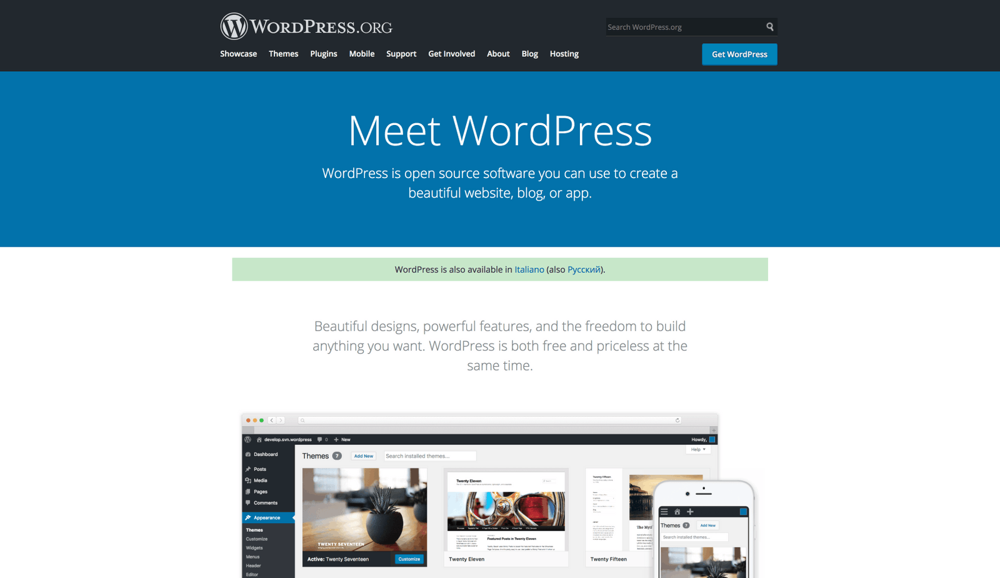
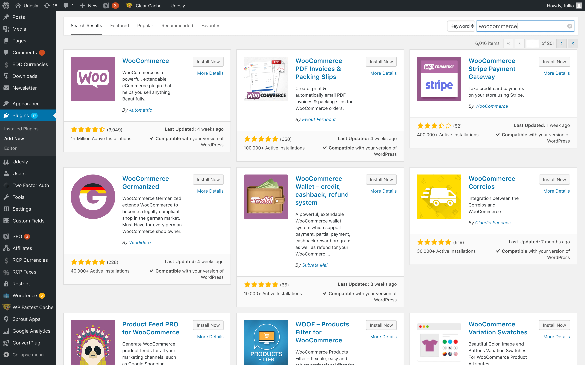
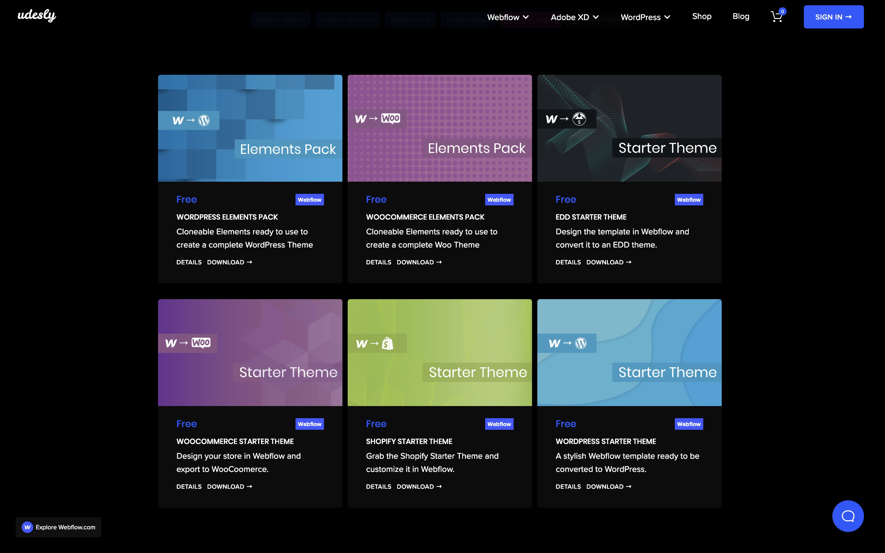
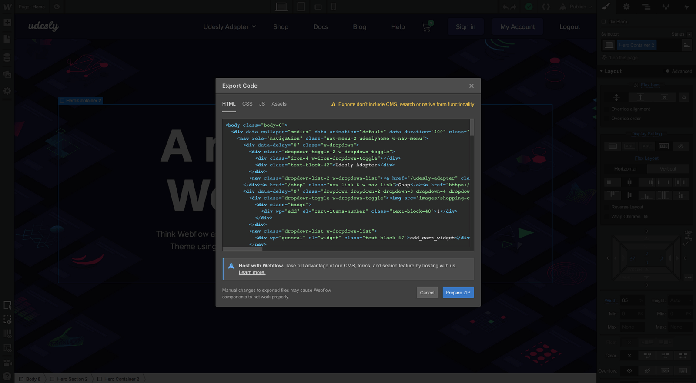
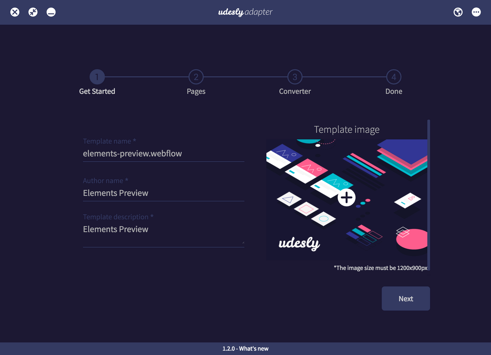
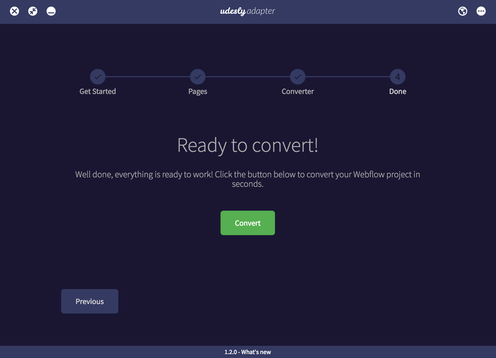
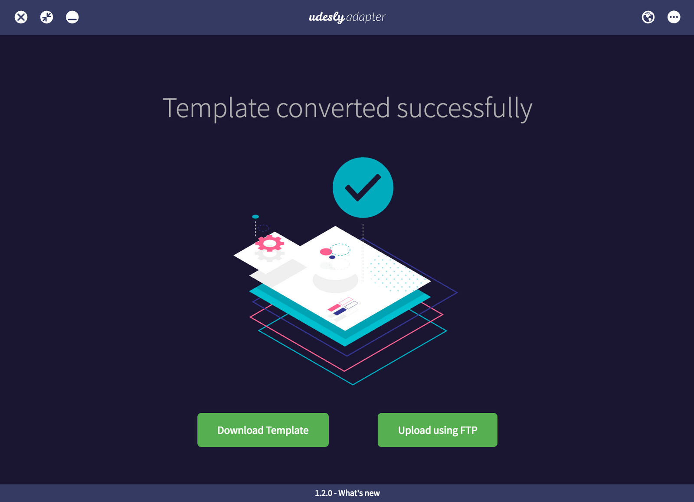
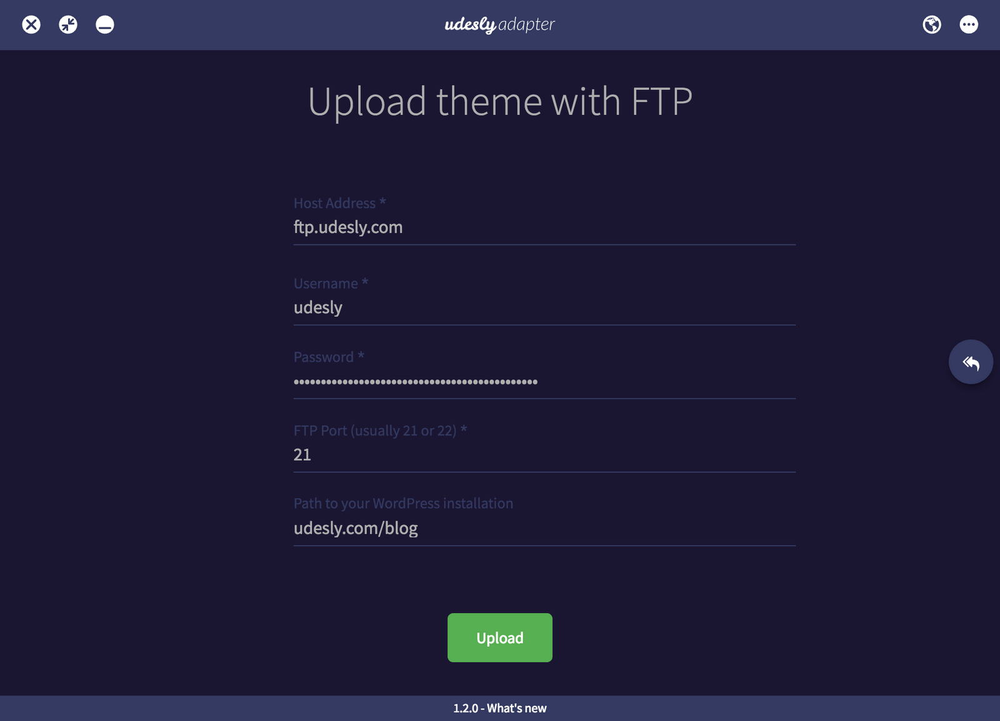
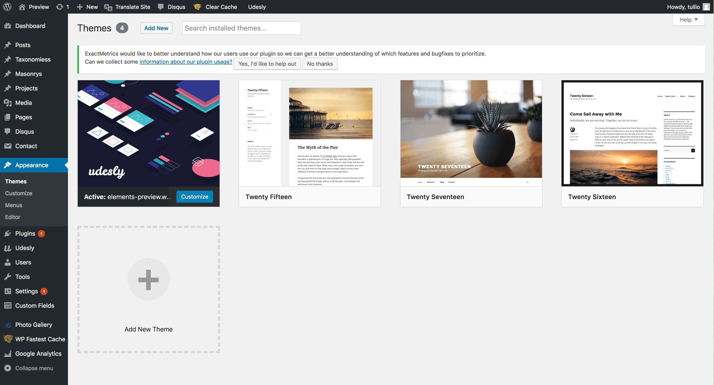
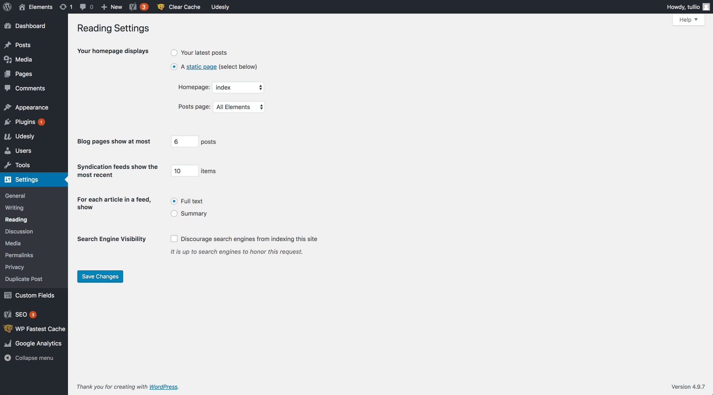

## Install WordPress
You need to have WordPress already installed on your hosting. [Here](https://codex.wordpress.org/Installing_WordPress) you can find the official WordPress installation guide. These are the [minimum requirement](https://docs.udesly.com/webflow-resources/adapter/advanced-doc/miscellaneous/requirements/) you need to start.

## Install WooCommerce
You need to have WooCommerce plugin installed. You can download and install it from WordPress plugin library. Go to “plugins” tab and click on “Add New” button and look for the plugin in this. Once the plugin has been installed, activate it.

## Generate the License Code
Go to your account page to generate the license code you need to activate the application.

## Download the APP
Download the app and plugins from [this page](https://www.udesly.com/shop/category/webflow/udesly-adapter/).

## Install on MAC OS/Windows
 **MAC OS** 
After you double click on the .dmg file you need to drag&drop the Udesly App in your Application folder

 **Windows** 
Double click on the .exe file to launch the App.

## Export the Webflow template
Before you start using the App remember to export your Webflow template with the [elements](https://www.udesly.com/shop/category/webflow/udesly-adapter/) included or use our [Starter Theme](https://www.udesly.com/shop/woocommerce-starter-theme/).

## Activate the APP
Insert your email and the license code you’ve generated from your account page.

## Upload the template
Upload the exported Webflow template you have created with the Udesly Elements.

## Insert your template data
Insert your template name, the author name and a template description. If you want, you can also choose the featured image of your theme (that you can find in your WordPress admin panel after the conversion).

## Set the pages of your template
This is the most important step. Here you need to set up all the WooCommerce pages of your Webflow template to make them ready to use in WordPress.
Here is the list of the page types you can assign to each page of your Webflow project:

#### WooCommerce Pages:
– Shop (this is the Shop page in which you can manage all the products included in your storage);
– Single Product (this page illustrates the card of the single product and all its specifications);
– Category (Used to style a specific category archive page of your shop, the page must be named as the slug of the category);
– Tag (Used to style a specific tag archive page of your shop, the page must be named as the slug of the tag);
– Single Product Template (pre-styled page that can be choosen to style a product of your shop differently);
– Search Results (page used to show the search results of a specific query within WooCommerce, it must contain the element “Search Results”).

If your site includes the blog as well, you must set the appropriate pages. Take a look here.

‍

## Optional Settings
In this step you can choose if you want to manage your website SEO from Webflow or from the WordPress admin panel directly. We suggest to not uncheck the “Remove Webflow jQuery”to make it work correctly.

## Start the conversion
You’re finally ready to convert your template. Just click on the “convert” button and the conversion will start.

## Download and upload
Once the conversion is ended you can choose to download the converted template in a zip file and upload it with an external FTP client or upload it through the Udesly integrated FTP System directly.

#### Upload with external FTP client

#### Upload with Udesly FTP system
If you choose our FTP System you only need to fill the fields below and click on the Upload button.

## Activate WordPress template
At this point you only have to jump to your WordPress admin panel and activate the theme following the path Appearance -> Themes.

## Set the pages
Remember to set the homepage and the Posts page (if your site includes a Blog system) of your site following this path: Settings -> Reading -> Your homepage display section.

## Install the Udesly Customizer plugin
Use this free WordPress plugin to customize the WooCommerce default pages (Cart, Checkout and My Account) and elements style. Thanks to the Udesly customizer you can control many elements you can’t change in your Webflow design, directly from the frontend of your site. You can find the Customizer documentation following this [link](https://docs.udesly.com/webflow-resources/udesly-customizer-plugin/).

<iframe width="700" height="419" src="https://www.youtube.com/embed/ptijHc9AsmE" frameborder="0" allow="accelerometer; autoplay; encrypted-media; gyroscope; picture-in-picture" allowfullscreen></iframe>

<iframe width="700" height="419" src="https://www.youtube.com/embed/05zYDAtJw78" frameborder="0" allow="accelerometer; autoplay; encrypted-media; gyroscope; picture-in-picture" allowfullscreen></iframe>
