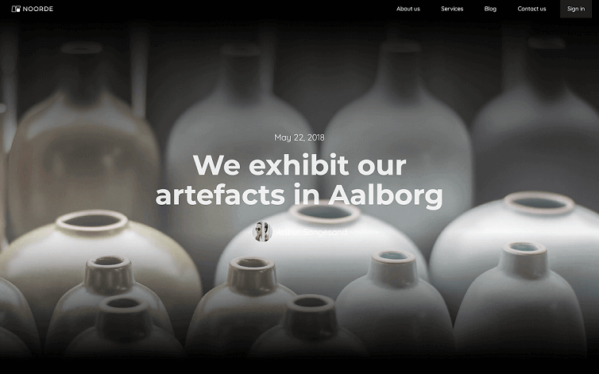

In WordPress that are several type of pages that can display a single post of your Blog. Don't forget to define your page accordingly to the list below by adding the correspondent attribute on the body of the page:

<pre>
<video autoplay muted playsinline="true" loop>
<source src="/assets/page-type.webm">
</video>
</pre>

## Single Post Pages

- **Single Post Page**

    This page is used for each Post of your WordPress Blog. This page must have the following attribute on the Body:

    > page=single

- **Specific Post**

    This page is used for a *specific* post of your WordPress Blog. This page must have the following attribute on the Body:

    > page=single
    >
    > specific={slug of your post or ID of your post}

- **Single Post Template**

    This page is a template that can be used instead of your generic single post page. To be displayed, you have to select the template from WordPress backend (for each post). This page must have the following attribute on the Body:

    > page=template
    >
    > post-type=post

*The following list includes all elements you can enter within these pages.*

> **Tips:**
> Take a look at our [elements pack](https://webflow.com/website/webflow-to-wordpress-elements-pack). It’s a set of all the most used elements with the necessary custom attributes already added. You just need to copy and paste the element in your Webflow page and give it your own style. This will help you quicken the workflow. If you have already completed your design and just want to convert the project to WordPress, maybe the quicker way to proceed is to add the custom attributes manually following our guide.
>
> Otherwise, if you want to start from scratch, follow the guide below.

## Date & Time
It is the date and the time of publication of the post. Insert a text element and enter the attribute:

> item=date

To show the time of publication,  Insert a text element and enter the attribute:

> item=time

To handle the date format, you can use the following optional attribute:

> format={date-format}

For date format type use [this guide](https://wordpress.org/support/article/formatting-date-and-time/)

## Featured Image
It's the featured image of the post. It can be added to an image or to any other element as background image, will also add the link if set on a link block.
Insert the attribute:

> item=featured-image

To handle featured image settings, there are an optional attribute you can use:

> dimension={dimension}

Dimension can be 'full', 'medium', 'thumbnail', 'large' or defined in width and height (e.g 300, 500... don't forget spaces between values!)

## Title
It's the title of the post and can be added to any text element, will also add the link if set on a link text.
Insert the attribute:

> item=title

## Excerpt
It's the excerpt of the post and can be added to any text element. Insert the attribute:

> item=excerpt

## Avatar
It's the image of the author from Gravatar. It can be set on a Image or Div. Insert the attribute:

> item=avatar

## Author Data
It displays author data and can be set on a text element. Attributes available are:

> item=author-display-name
>
> item=author-nickname
>
> item=author-first-name
>
> item=author-last-name

## Author Description
It displays the author description and can be set o a text element. Insert the attribute:

> item=author-description

## Author Url
It allows to link to the page showing posts of that specific author. Insert a Link element and add the attribute:

> item=author-url

## Author Contacts
To link to social or email accounts of a specific author, you have to insert a Link element and add the attributes regarding the contact you want to link among these:

> item=author-email
> 
> item=author-facebook
>
> item=author-linkedin
>
> item=author-youtube 
>
> item=author-twitter
>
> item=author-dribble
>
> item=author-instagram
>
> item=author-phone

## Main Category 
This is the link to the main category of a specific post. Insert a Button or a Link element and add the attribute:

> item=main-category

## Permalink
This is a link to a specific post. Insert a link element and add the attribute:

> item=permalink

## Categories
It shows categories of the post and it must be added on a link element. This one will be repeated and if the link is inside a **List Item**, the whole List Item will be repeated.
 Insert the following attribute on the Link element:

> item=categories

Optionally, you can limit the number of categories to show adding the attribute

>limit={number}

## Tags
It shows tags of the post and it must be added on a link element. This one will be repeated and if the link is inside a **List Item**, the whole List Item will be repeated.
Insert the following attribute on the Link element:

> item=tags

Optionally, you can limit the number of tags to show adding the attribute

>limit={number}

## Content
Insert a Richtext element and add the attribute:

> item=content

## Internal Navigation
To enable the internal pagination of a specific post, insert Link or Button items and add the attributes:

> item=next-page
>
> item=prev-page

## External Navigation
To enable the external pagination among posts, insert Link or Button items and add the attributes:

> item=next-post
>
> item=prev-post

With the Adapter 2.0 you can paginate not only the link to another post, but also include other elements of the post at issue, such as the featured image or the title, for example.
Inside a Div you can add:

> item=title
>
> item=permalink
>
> item=featured-image
>
> item=excerpt

## Breadcrumbs

Insert a List element and add the attribute:

> blog=breadcrumbs

The List element must contain 3 List items: the first one must contain a Link and it represent the breadcrumb to the parent category. The second List item is the separator and the third one is the current post. No attributes are needed on these List items.

---------
> **Take in Mind**
>
> In our documentation you will find custom attributes in 2 formats:
>
> **name=value** or **name={dynamic-value}**
>
>
> **Attribute**             | **Meaning** | 
> -------------             | --------------- |
> | item=title              | *item* is the *Name* and *title* is the *Value* |
> | dimension={dimension}   | *dimension* is the *Name* and instead of {dimension} you have to insert one of the accepted value that you'll find indicated each time. For example dimension can be *master*|