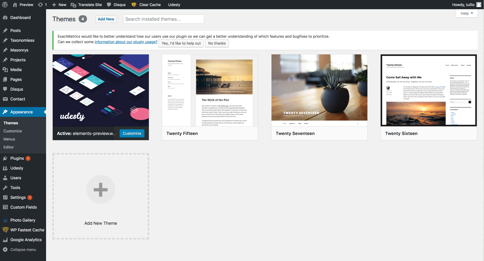
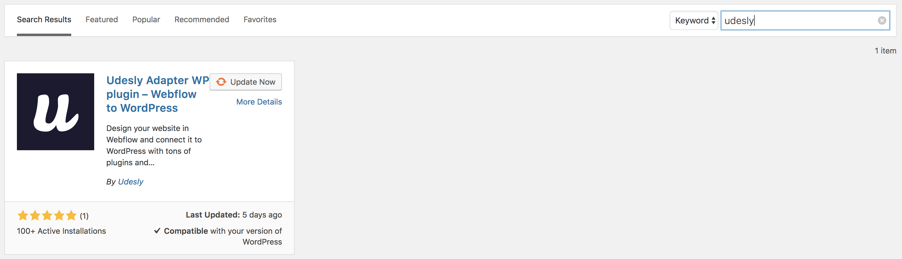
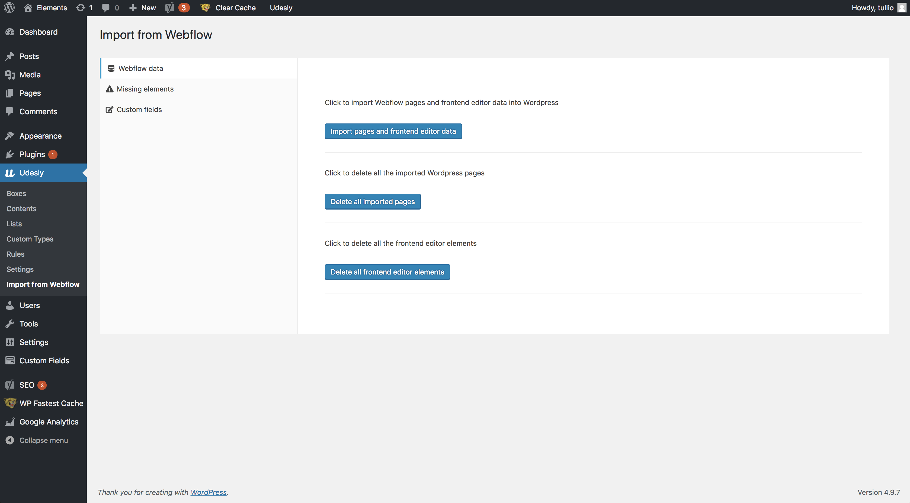
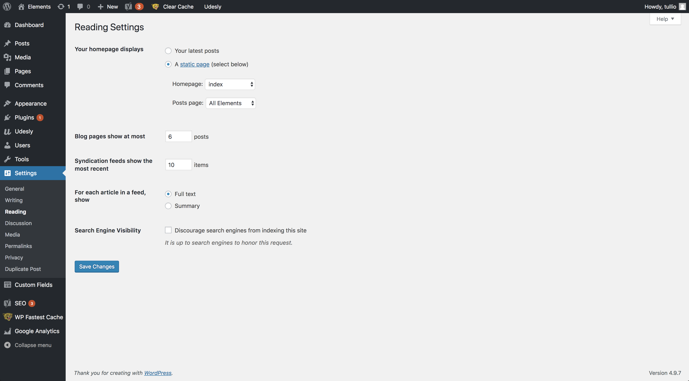

## Activate the WordPress theme
At this point you only have to jump to your WordPress admin panel and activate the theme following the path Appearance -> Themes.

## Download the Udesly Plugin
You have to download and install the Udesly plugin directly from the WordPress admin panel following this path: Plugins-> Add New -> Search for Udesly.

## Import data from Webflow
This is the most important section. After the converted template upload and activation, you have to synchronize the template content. From the "Import from Webflow" section you can find the "Import pages and frontend editor data" button to synchronize the Webflow template content with WordPress. You can also delete all the imported pages or frontend editor elements. From the side menu you can check your missed elements and custom fields.

## Page Settings
Remember to set the homepage and the Posts page of your site following this path: Settings -> Reading -> Your homepage display section.

