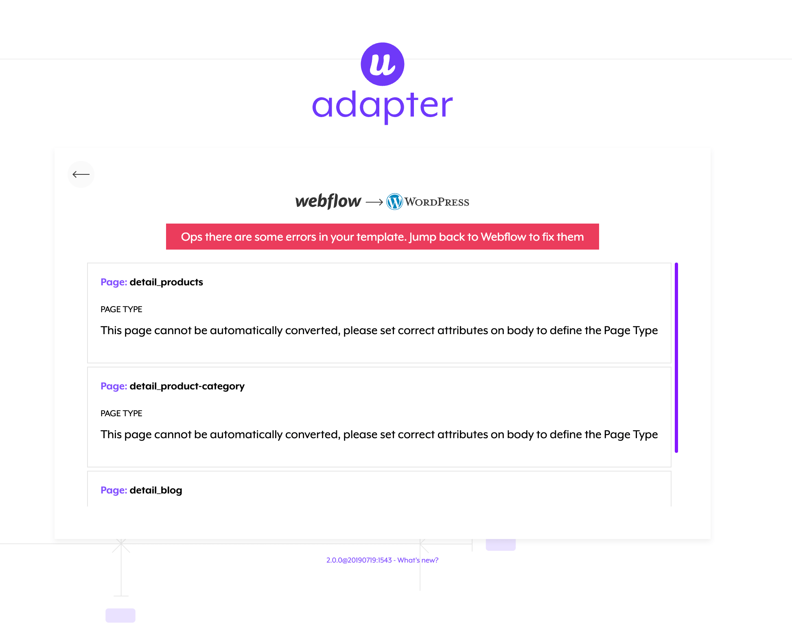

Follow this short guide to convert a Webflow project to a functioning WordPress template.

**To make the following conversion process effective, make sure you have entered in Webflow all the custom attributes required.** 

## Export & Convert

Once your design is finished, the page types and the page elements are defined with their attributes, you can finally export your template.

<video autoplay muted playsinline="true" loop>
<source src="/assets/export-code.webm">
</video>

## Upload to the Adapter

Open the Udesly Adapter Web APP you can find on [udesly.com](https://www.udesly.com/) and choose the WordPress section to upload your template.

Upload the .zip file of the template you've exported from Webflow, insert template data (template name, author name, template description) and start the conversion.

<video autoplay muted playsinline="true" loop>
<source src="/assets/webflow-to-wordpress.webm">
</video>

If you forgot to add some attributes or added the wrong ones, the conversion process will end with an error message like the one in the screenshot.

 You’ll find all the missing attributes and the wrong ones that you’re required to fix. This will help you go back to your project and correct everything to launch a new, successful, conversion. 

## Upload and activate the theme in WordPress

Once the conversion is ended you can download the converted template (zip file) on your pc.

Now you can upload the converted theme (.zip file) from your WordPress admin panel. Go to Appearance -> Themes and then click on the “Upload Theme” button.

**Don't forget to Activate the Theme**

