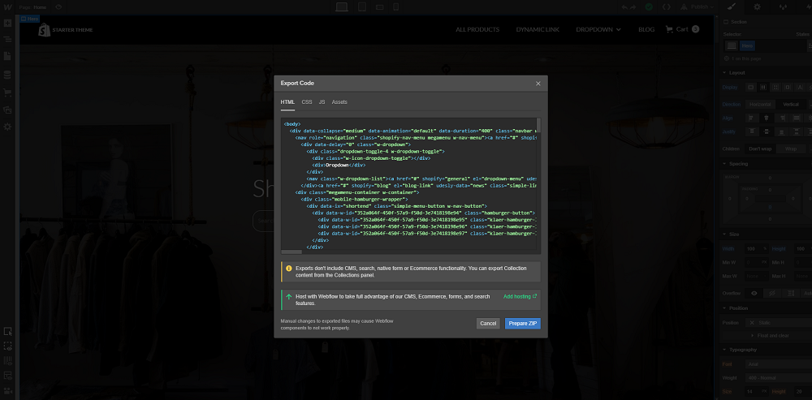
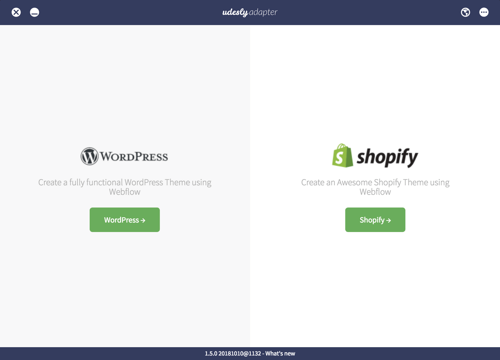

## Export & Convert

Once your design is finished, all the custom attributes has been entered and page types has been defined, you can finally export your template.

Open the Udesly Adapter Web APP you can find on [udesly.com](https://www.udesly.com/) and choose the WordPress section to upload your template.

Upload the .zip file of the template you've exported from Webflow, insert template data (template name, author name, template description) and start the conversion.

## Upload

Once the conversion is ended you can download the converted template (zip file) on your pc.

Now you can upload the converted theme (.zip file) from your WordPress admin panel. Go to Appearance -> Themes and then click on the “Add Theme” button. Once done, activate the template.

