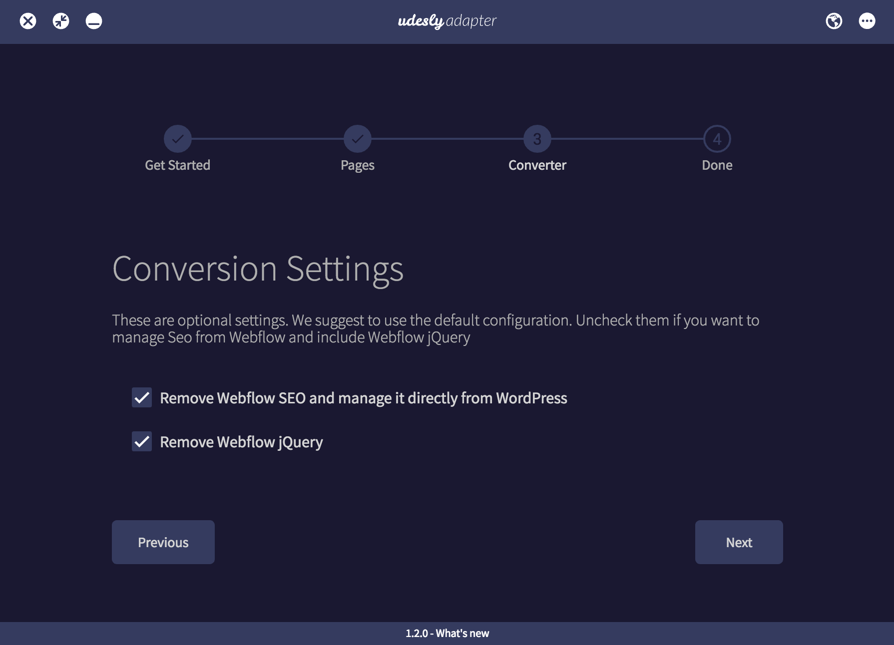
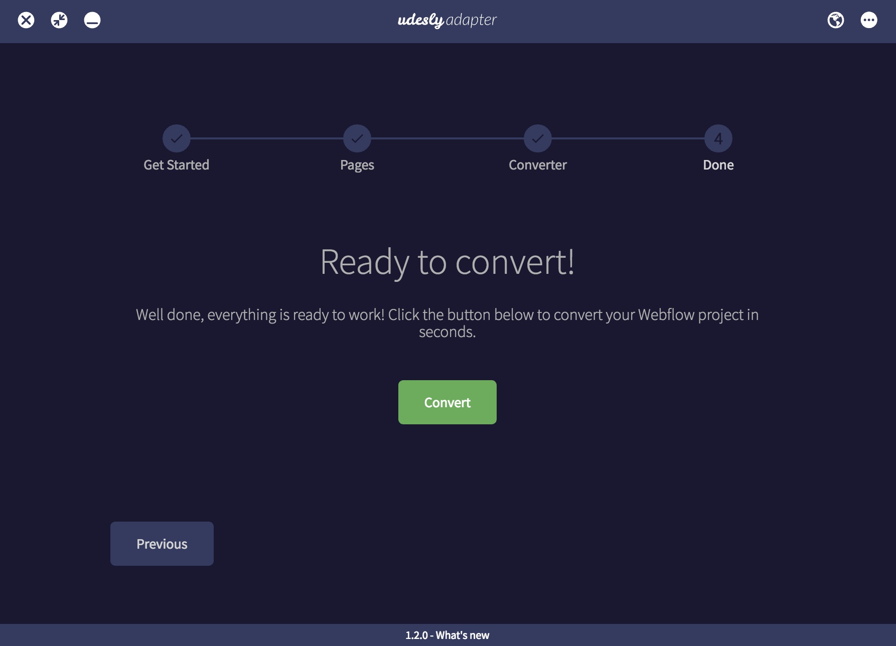
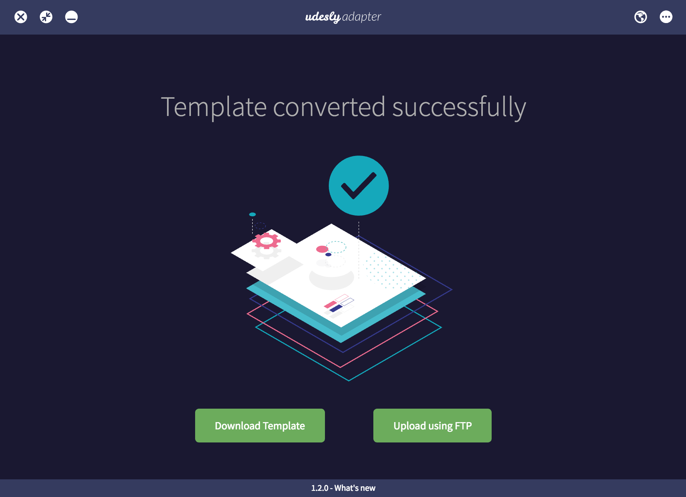
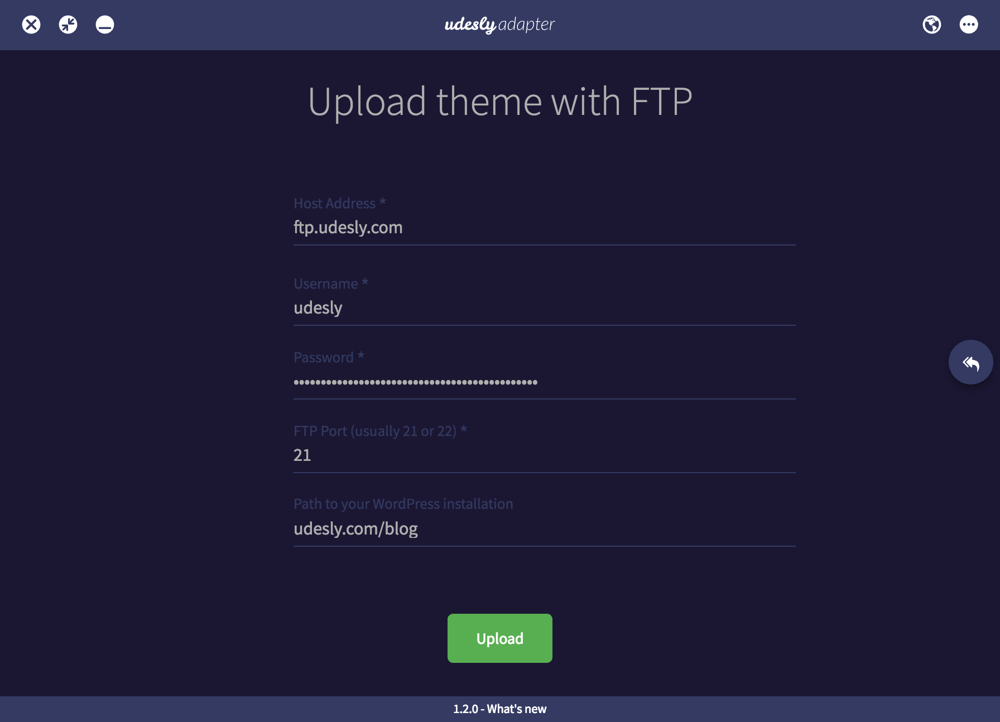

## Conversion Settings
In this step you can choose if you want to manage your website SEO from Webflow or from the WordPress admin panel directly. We suggest to not uncheck the "Remove Webflow jQuery" to make it work correctly. You can also disable the Frontend Editor.

## Start the conversion
You're finally ready to convert your template. Just click on the "convert" button and the conversion will start.

## Download or upload
Once the conversion is ended you can choose to download the converted template in a zip file and upload it with an external FTP client or upload it through the Udesly integrated FTP System directly.

## Upload with Udesly FTP system
If you choose our FTP System you only need to fill the fields below and click on the Upload button.

