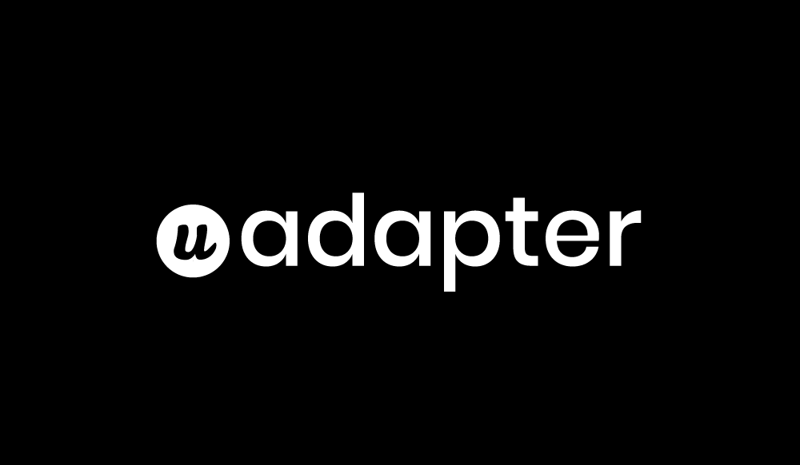

Udesly Adapter is a new App for webdesigners. With it you can connect Webflow to the most powerful CMS (Wordpress, Shopify etc.) and ecommerce platforms in the world to build impressing experiences. Just use Webflow to design visually with pixel accuracy and manage any content from the WordPress CMS.
No matter your needs, the huge WordPress community has you covered with tons of plugins to choose from.

