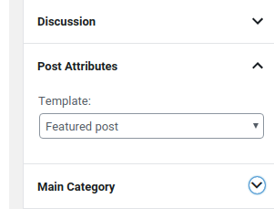

In order to have a Webflow template ready to be converted to a WordPress one, Adapter must understand what kind of pages you created in your Template.
WordPress usage needs the understanding of his template structure. You can find a review below.

<video autoplay muted playsinline="true" loop>
<source src="/assets/page-type.webm">
</video>

## WordPress Pages Hierarchy

WordPress uses a clearly defined hierarchy to decide which template should be used to display a page you are visiting. We can easily classify pages of the template based on 3 main features:

 1. **Page Type**: each page you create has a *type* that defines its use in WordPress, like *archive*, *single*, *search*, *template*, *taxonomy*;
 2. **Post Type**: WordPress works with different types of content. These content types are normally described as Post Types, which may be a little confusing since it refers to all different types of content in WordPress. For example, a post is a specific Post Type, and so is a page.
 3. **Specificity**: A page can be *generic* (it's used to display different *object* of the same type) or be *specific* (it's used to display one *object*). For example a *single post page* it's a generic page that it's used to display several posts of your blog, a *specific post page* it's used to display only one specific post of your blog.

You can define the type of page you need using a combination of the attributes below. 

 > page={page-type}

 > post-type={post-type}

 > specific={slug or id}

Don't worry, it's not necessary for all pages, and you can find below a cheatsheet with all the most used pages and the respective attributes. Almost all pages are automatically recognized and only CMS pages needs attributes to be inserted manually. Moreover some CMS pages are also automatically recognized if you used the premade CMS collections of Webflow. All pages that are not related to CMS and have no attributes will just be used as Generic pages (they will be created in WordPress when you press on *import* from WordPress > Udesly > Webflow Data).

## Automatically Recognized Pages
Some pages are automatically recognized based on their name and they do not need any attribute in their Body element: 

**Page Name** | **Page**
------------ | ----------------------
index         | Home Page
404           | Not found 
password      | 401 
search        | Search 

## Automatically Recognized CMS Pages
The list below indicates CMS pages that are automatically recognized based on their name and they do not need any attribute in their Body element:

**Page Name**                   | **Page Type**          | **Post Type**
-------------                   | ---------------------- | ----------------
detail_product                  | Single                 | Product
detail_category                 | Archive                | Product
detail_article                  | Single                 | Post
detail_post                     | Single                 | Post 

**NB:** CMS pages are named with the prefix **detail_** followed by the singular name of your CMS collection by Webflow itself. For example, **detail_product** and **detail_category** pages are created by Webflow if you enable e-commerce and you find them with the names **Products Template** and **Categories Template** in Webflow pages menu.

All pages without attribute that are not CMS related are automatically recognized as **Template**.
Otherwise you can define the page type by inserting the required attribute in the Body of the Webflow page.

**N.B:** All CMS pages that cannot be automatically recognized *must* have the correct attribute on the Body element, otherwise the template will not be converted.

## Blog Pages

In WordPress you can create several pages to customize all the blog functionalities, only 2 pages are strictly required to have a functionality Blog: *Archive Post Page* and *Single Post Page*

### Archive Post Page

This page is used for Blog Page and for all archives of your WordPress CMS if a more specific template is not defined 
To define a page as archive just add the following attribute on the Body element of your page

> page = archive

### Single Post Page

This page is used to display a single post of your Blog.

> page = single

### Specific Single Post Page

This page will be used instead of the Single Post Page when surfing a specific post of your Blog.
To create a specific post page just add the attributes on the Body element of your page

> page = single
>
> specific = {slug or id of your post}

You can also insert more IDs or slugs separated by commas, in order to have more template pages

For example, if we add the following attributes on the body of a page

> page = single
>
> specific = hello-world

we can customize the page displayed by WordPress when surfing the *Hello World* post of your Blog.

### Template for Single Post Page

This page will be used instead of the Single Post Page when surfing a post of your Blog where you selected this specific template from the template selector.
To create a template for single post page just add the attributes on the Body element of your page

> page = template
>
> post-type = post

### Category Page

If this page is present in your Webflow template, every time you visit a category of your blog, this page will be used instead of the Blog Page, to create a category page just add the following attribute on the Body element of your page

> page = taxonomy

### Specific Category Page

This page will be used instead of the Blog Page, for a specific category. To create a specific category page just add the following attribute on the Body element of your page

> page = taxonomy
>
> specific = {slug or id of your category}

You can also insert more IDs or slugs separated by commas, in order to have more template pages

For example, if we add the following attributes on the body of a page

> page = taxonomy
>
> specific = travel

we can customize the page displayed by WordPress when surfing the *Travel* category of your Blog.

### Tag Page

If this page is present in your Webflow template, every time you visit a tag of your blog, this page will be used instead of the Blog Page, to create a tag page just add the following attribute on the Body element of your page

> page = taxonomy
>
> post-type = tag

### Specific Tag Page

This page will be used instead of the Blog Page, for a specific tag. To create a specific tag page just add the following attribute on the Body element of your page

> page = taxonomy
>
> post-type = tag
>
> specific = {slug or id of your tag}

You can also insert more IDs or slugs separated by commas, in order to have more template pages

For example, if we add the following attributes on the body of a page

> page = taxonomy
>
> post-type = tag
>
> specific = beach

we can customize the page displayed by WordPress when surfing the *Beach* tag of your Blog.

### Author Page
 
This page is used to show the list of posts created by a given Author. This page must have the following attribute on the Body:

> page=archive
>
> post-type=author
    

### Specific Author Page

If you want to give a different style to a given Author page, you have to set it as Specific Author page. This page must have the following attribute on the Body:

> page=archive
>
> post-type=author
>
> specific={author nicename or author ID}

You can also insert more IDs or nicenames separated by commas, in order to have more template pages

## WooCommerce Pages

In WordPress you can create several pages to customize all the WooCommerce functionalities, only 2 pages are strictly required to have a functionality WooCommerce: *Archive Product Page* and *Single Product Page*

### Archive Product Page

This page is used for Shop Page, Product Category Page, Product Tag Page and for Product Search Page if a more specific template is not defined 
To define a page as archive product just add the following attribute on the Body element of your page

> page = archive
>
> post-type = product

### Single Product Page

This page is used to display a single product of your WooCommerce Shop.

> page = single
>
> post-type = product

### Template for Single Product Page

This page will be used instead of the Single Product Page when surfing a Product of your Shop where you selected this specific template from the template selector.
To create a template for single post page just add the attributes on the Body element of your page

> page = template
>
> post-type = product

### Product Category Page

If this page is present in your Webflow template, every time you visit a product category of your shop, this page will be used instead of the Shop Page, to create a product category page just add the following attribute on the Body element of your page

> page = taxonomy
>
> post-type = product_cat

### Specific Category Page

This page will be used instead of the Archive Product Page, for a specific product category. To create a specific product category page just add the following attribute on the Body element of your page

> page = taxonomy
>
> post-type = product_cat
>
> specific = {slug or id of your category}

You can also insert more IDs or slugs separated by commas, in order to have more template pages

For example, if we add the following attributes on the body of a page

> page = taxonomy
>
> post-type = product_cat
>
> specific = shoes

we can customize the page displayed by WordPress when surfing the *Shoes* category of your Shop.

### Product Tag Page

If this page is present in your Webflow template, every time you visit a product tag of your Shop, this page will be used instead of the Archive Product Page, to create a tag page just add the following attribute on the Body element of your page

> page = taxonomy
>
> post-type = product_tag

### Specific Tag Page

This page will be used instead of the Archive Product Page, for a specific product tag. To create a specific tag page just add the following attribute on the Body element of your page

> page = taxonomy
>
> post-type = product_tag
>
> specific = {slug or id of your tag}

You can also insert more IDs or slugs separated by commas, in order to have more template pages

For example, if we add the following attributes on the body of a page

> page = taxonomy
>
> post-type = product_tag
>
> specific = red

we can customize the page displayed by WordPress when surfing the *Read* tag of your Shop.

### Product Search Page

If this page is present in your Webflow template, every time you search for a product this page will be used instead of the Search Page, to create a Product search page just add the following attribute on the Body element of your page

> page = search
>
> post-type = product

## Custom Post Type Pages

In WordPress there are several plugins that creates Custom Post Type and you can even create Custom post types using the Udesly Adapter. (Every Custom Post type that you use in the template that is not defined by a third party plugin will be generated automatically for you)

### Archive Page

This page is used for the Archive Page of your Custom Post type.
To define a page as archive just add the following attribute on the Body element of your page

> page = archive
>
> post-type = {your custom post type}

### Single Page

This page is used to display a single custom post type

> page = single
>
> post-type = {your custom post type}

### Specific Single Page

This page will be used instead of the Single Page when surfing a specific post of your Custom post type.
To create a specific single page just add the attributes on the Body element of your page

> page = single
>
> post-type = {your custom post type}
>
> specific = {slug or id of your post}

You can also insert more IDs or slugs separated by commas, in order to have more template pages

For example, if we add the following attributes on the body of a page

> page = single
>
> post-type = event
>
> specific = hello-world

we can customize the page displayed by WordPress when surfing the *Hello World* event.

### Template for Single Custom Post Type

This page will be used instead of the Single Page when surfing a post of your Custom Post Type where you selected this specific template from the template selector.
To create a template for single post page just add the attributes on the Body element of your page

> page = template
>
> post-type = {your custom post type}

### Taxonomy Page

If this page is present in your Webflow template, every time you visit a taxonomy of your cutsom post type, this page will be used instead of the Archive Page, to create a taxonomy page just add the following attribute on the Body element of your page

> page = taxonomy
>
> post-type = {your taxonomy}

e.g: If you create a custom post type Event using the Udesly Adapter plugin and set as taxonomy category, you can use

> page = taxonomy
>
> post-type = event_category

### Specific Taxonomy Page

This page will be used instead of the Archive Page, for a specific taxonomy. To create a specific taxonomy page just add the following attribute on the Body element of your page

> page = taxonomy
>
> post-type = {your taxonomy}
>
> specific = {slug or id of your taxonomy}

You can also insert more IDs or slugs separated by commas, in order to have more template pages

For example, if we add the following attributes on the body of a page

> page = taxonomy
>
> post-type= event
>
> specific = concerts

we can customize the page displayed by WordPress when surfing the *Concerts* category of your Events post type.

### Search Page

If this page is present in your Webflow template, every time you search for a custom post type this page will be used instead of the Search Page, to create a custom post search page just add the following attribute on the Body element of your page

> page = search
>
> post-type = {your custom post type}

### Temporary Page

Insert your under-construction temporary place holder. This page needs the following attribute on the body:

> page = temporary

To enable temporary mode go to **Udesly > Settings > Tools**

---------
> **Take in Mind**
>
> In our documentation you will find custom attributes in 2 formats:
>
> **name=value** or **name={dynamic-value}**
>
>
> **Attribute**             | **Meaning** | 
> -------------             | --------------- |
> | item=title              | *item* is the *Name* and *title* is the *Value* |
> | dimension={dimension}   | *dimension* is the *Name* and instead of {dimension} you have to insert one of the accepted value that you'll find indicated each time. For example dimension can be *master*|