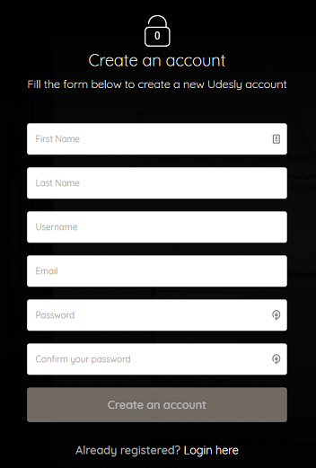

A registration form is a list of fields that a user will input data into and submit to a company or individual. Registration forms allow to sign up customers for subscriptions, services, or other programs or plans.

> **Tips:**
> Take a look at our [elements pack](https://preview.webflow.com/preview/webflow-to-shopify-elements?utm_medium=preview_link&utm_source=designer&utm_content=webflow-to-shopify-elements&preview=71280fc62c37d44b2222bbe7b9a3e953&mode=preview). It’s a set of all the most used elements with the necessary custom attributes already added. You just need to copy and paste the element in your Webflow page and give it your own style. This will help you quicken the workflow. If you have already completed your design and just want to convert the project to Shopify, maybe the quicker way to proceed is to add the custom attributes manually following our guide.
>
> Otherwise, if you want to start from scratch, follow the guide below.

Insert a **Form** element inside your page and insert the following attributes:

> login-area=register

The form needs the following input fields: 

 **Name**             | **Type** | 
 -------------        | --------------- |
 | first_name           | Plain |
 | last_name | Plain |
 | username | Plain | REQUIRED
 | email | Email | REQUIRED
 | password | Password | REQUIRED
 | password_repeat | Password | REQUIRED
 |                         | submit |

Select the form and change the status to **Error**
Select the error message text block and insert the attribute:

> item=error-message

In this way the error message text will be replaced with the right message automatically.

**Logged in** users should not be able to see the page where you insert this form. To this purpose it would be preferable to wrap this logout element in a div with attribute:

> hide-if=logged-in

---------
> **Take in Mind**
>
> In our documentation you will find custom attributes in 2 formats:
>
> **name=value** or **name={dynamic-value}**
>
>
> **Attribute**             | **Meaning** | 
> -------------             | --------------- |
> | item=title              | *item* is the *Name* and *title* is the *Value* |
> | dimension={dimension}   | *dimension* is the *Name* and instead of {dimension} you have to insert one of the accepted value that you'll find indicated each time. For example dimension can be *master*|
 