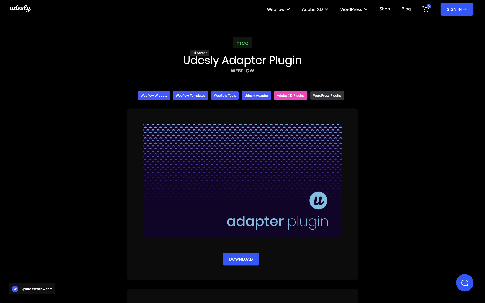
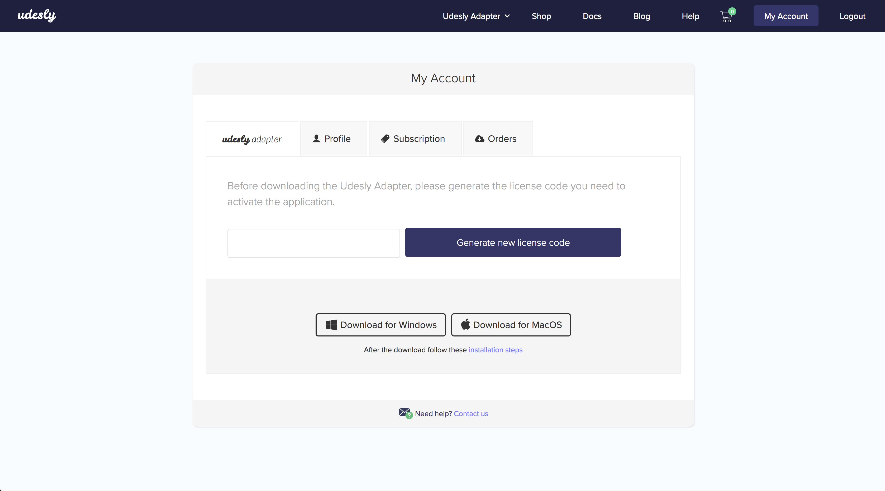
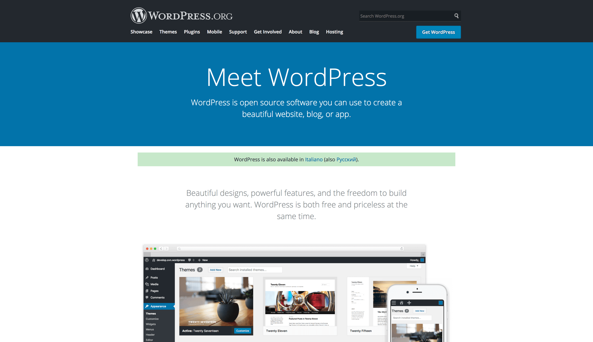

## Download the APP
Download the app and plugins from [this page](https://www.udesly.com/shop/category/webflow/udesly-adapter/).

## Generate the License Code
Go to your account page to generate the license code you need to activate the application.

## Install on Mac OS
After you double click on the .dmg file you need to drag&drop the Udesly App in your Application folder

## Install on Windows
Double click on the .exe file to launch the App.

## Activate the APP
Insert your email and the license code you've generated from your account page.

## Install WordPress
You need to have WordPress already installed on your hosting. Here you can find the official WordPress installation guide. These are the minimum requirement you need to start.

